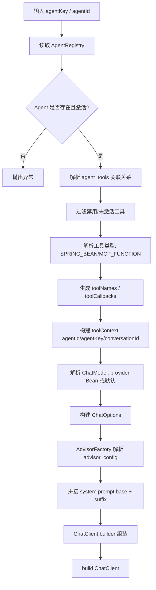
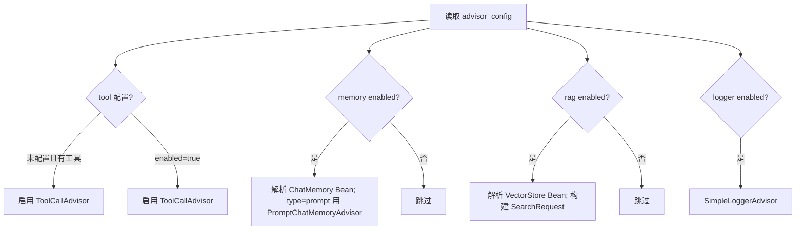
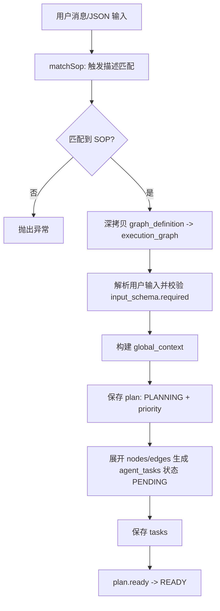
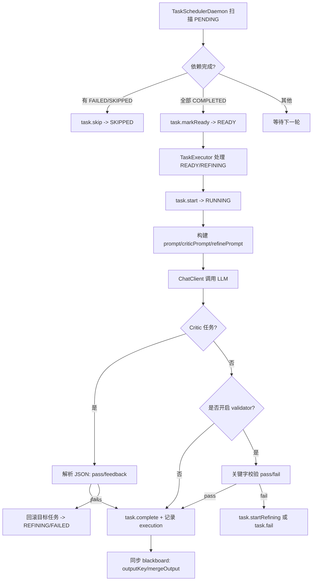
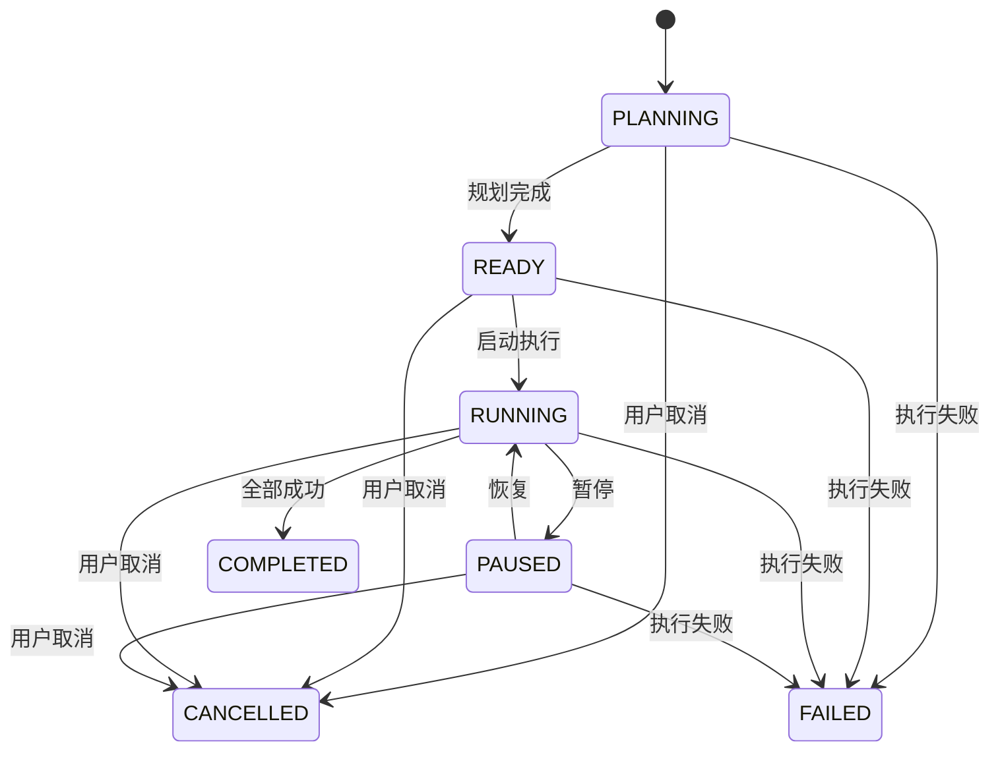
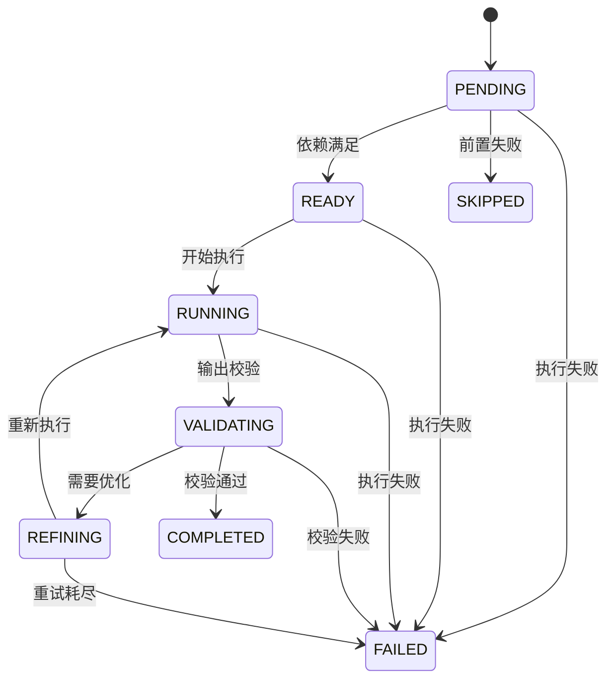

# 软件设计说明书

> 版本说明：设计与实现基于 Spring AI 1.1.2 API（Spring Boot 3.4.3）。

## 概要设计 (HLD)

### 1. 系统架构
- **形态**：单体应用（Spring Boot）+ DDD 分层的多模块 Maven 工程。
- **分层**：
  - `agent-app`：应用启动与全局配置装配（线程池、数据源、Spring AI 自动装配）。
  - `agent-trigger`：入口适配层（HTTP/SSE/Job 调度）。
  - `agent-domain`：领域模型与端口接口。
  - `agent-infrastructure`：仓储、DAO、MyBatis 实现与第三方适配。
  - `agent-api` / `agent-types`：对外 DTO 与通用类型。
- **入口与调度**：
  - HTTP：`/api/sessions`（创建会话）、`/api/sessions/{id}/chat`（触发规划）、`/api/plans/{id}/stream`（SSE 事件流）。
  - Job：`TaskSchedulerDaemon`（PENDING→READY 依赖调度）、`TaskExecutor`（执行 READY/REFINING）。

### 2. 技术栈与选型原因
- **Java 17 + Spring Boot 3.4.3**：LTS 版本，生态成熟，便于运维。
- **Spring AI 1.1.2**：统一 ChatClient/Advisor/ToolCalling 接口，屏蔽模型差异。
- **MyBatis 3.0.4**：SQL 可控，便于 JSON 字段读写与调优。
- **PostgreSQL**：JSONB + GIN 索引，适合存储 `model_options` / `graph_definition` 等配置。
- **Jackson / Guava Cache**：统一 JSON 解析与短期热点缓存。

### 3. 第三方服务与基础能力
- **LLM**：通过 `spring.ai.openai.*` 接入 OpenAI 或兼容协议服务。
- **工具调用**：支持 Spring Bean 工具与 MCP Server 工具。
- **RAG**：可装配 `VectorStore` Bean，按配置启用向量检索。
- **SSE**：计划执行过程流式回传前端。

### 4. 数据模型（概要）
- `agent_registry`：Agent 配置（model_provider / model_options / advisor_config / base_system_prompt）。
- `agent_tool_catalog` / `agent_tools`：工具目录与 Agent-工具关联关系。
- `agent_sessions`：用户会话。
- `sop_templates`：SOP 模板（trigger_description / graph_definition / default_config）。
- `agent_plans` / `agent_tasks`：执行计划与任务。
- `task_executions`：任务执行记录（prompt/response/验证结果）。
- `vector_store_registry`：向量存储注册信息。

### 5. 配置约定
- 环境配置：`agent-app/src/main/resources/application-*.yml`（dev/test/prod）。
- LLM：`spring.ai.openai.*` 支持 `OPENAI_API_KEY/OPENAI_BASE_URL`。
- 调度：`scheduler.poll-interval-ms`、`executor.poll-interval-ms`（默认 1000ms）。
- 线程池：`thread.pool.executor.config.*`（核心/最大线程、队列大小、拒绝策略）。

## 详细设计 (LLD)

### 1. 核心业务逻辑流程图

#### 1.1 Agent 工厂构建流程

#### 1.2 Advisor 选择流程

#### 1.3 规划与建图流程（Planner）

#### 1.4 任务调度与执行流程

### 2. 关键算法说明

**2.1 工具解析算法**
- 输入：`agent_tools` 关联表 + `agent_tool_catalog`。
- 逻辑：
  - 按 `priority` 升序排序（null 视为最大值），过滤 `is_enabled=false` 与工具未激活记录。
  - `SPRING_BEAN`：优先读取 `tool_config.beanName`（含 `bean_name/toolBeanName` 等别名），否则使用 `tool_name`。
  - `MCP_FUNCTION`：读取 `tool_config.mcpServerConfig`（或 `serverConfig/server`），通过 `McpClientManager` 构建官方 `SyncMcpToolCallback`。
- 输出：`toolNames` 去重集合 + `toolCallbacks` 列表。

**2.2 Advisor 解析算法**
- `advisor_config` → `AgentAdvisorConfig`（支持 `toolCall/simpleLogger` 等别名字段）。
- `ToolCallAdvisor`：未配置时有工具即启用；配置存在且 `enabled=true` 才启用；支持 `order`。
- `Memory`：`enabled=true` 时解析 `ChatMemory` Bean（可指定 `beanName`）。`type=prompt` → `PromptChatMemoryAdvisor`（可设置 `systemPromptTemplate`），否则 `MessageChatMemoryAdvisor`。
- `RAG`：`enabled=true` 时解析 `VectorStore`（可指定 `vectorStoreName`），构建 `SearchRequest(topK/similarityThreshold/filterExpression)`；可设置 `promptTemplate`。
- `Logger`：`enabled=true` 时启用 `SimpleLoggerAdvisor`。

**2.3 ChatModel 解析算法**
- `model_provider` 对应的 `ChatModel` Bean 存在则优先使用；否则使用默认 `ChatModel`。
- 无可用 Bean 时抛出异常。

**2.4 ChatOptions 构建算法**
- `model_provider` 为空或 `openai`：使用 `OpenAiChatOptions`，从 `model_options` 反序列化并覆盖 `model`、`toolNames`、`toolContext`。
- 其他提供商：使用 `ChatOptions`，支持 `temperature/topP/topK/maxTokens/presencePenalty/frequencyPenalty/stopSequences`。

**2.5 MCP 客户端管理**
- 实现基于 Spring AI 1.1.2 官方 `McpSyncClient` 与 `SyncMcpToolCallback`。
- 传输方式：`transport` 显式指定；否则按 `command/sseUrl/url` 推断；`auto` 依次尝试 Streamable HTTP、SSE、stdio。
- stdio：通过 MCP SDK `StdioClientTransport` 启动 `command/args/env`。
- Streamable HTTP：通过 MCP SDK `HttpClientStreamableHttpTransport`。
- SSE：通过 MCP SDK `HttpClientSseClientTransport`。
- 超时：`readTimeoutMs/timeoutMs` 与 `connectTimeoutMs`。

**2.6 SOP 匹配与计划生成**
- `matchSop`：若 `trigger` 包含 `query` 或反向包含，得分 100；否则按分词命中数评分；分数相同取更高版本。
- `createPlan`：
  - JSON 入参自动解析，否则写入 `userQuery/query`。
  - 校验 `input_schema.required`。
  - 构建 `global_context`（会话、SOP 元信息 + 用户输入）。
  - plan 状态 `PLANNING`，`priority` 来自 `default_config.priority`（默认 0）。
  - 展开 `nodes/edges` 生成任务：`nodeId` 必填、`taskType` 默认 `WORKER`、合并 `default_config` 与节点 `config`；`maxRetries` 默认 3。

**2.7 任务执行与校验策略**
- Prompt：合并 `global_context` 与 `input_context`，可用 `contextKeys` 过滤；模板支持 `{{key}}/${key}/{key}`。
- Critic：输出 JSON `{\"pass\": true/false, \"feedback\": \"...\"}`；失败会将目标任务回滚到 `REFINING` 或直接失败。
- Validator：通过 `validator/validate/validation` 开关启用；支持 `passKeywords/failKeywords`。
- Blackboard：`mergeOutput=true` 时尝试合并 JSON；否则写入 `outputKey` 或 `nodeId`。

### 3. 状态机模型

#### 3.1 计划状态机（PlanStatusEnum）

#### 3.2 任务状态机（TaskStatusEnum）

> 备注：Critic 任务可能触发目标任务回滚至 `REFINING` 或直接 `FAILED`。
