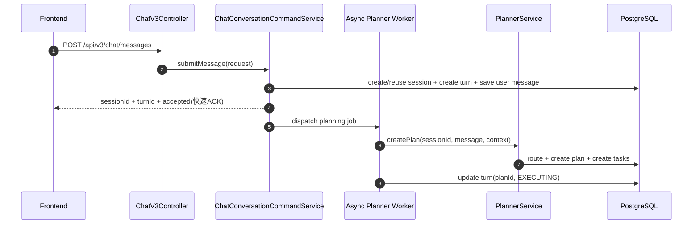
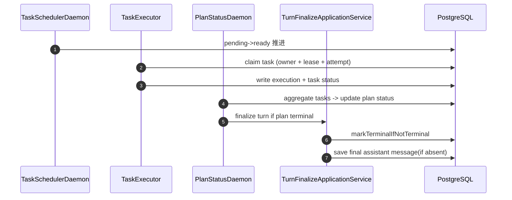
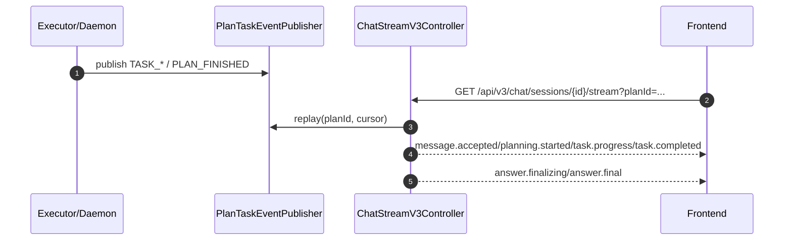

# 系统架构总览（Architecture）

## 1. 文档目标

本文档回答四个问题：

- 系统边界是什么（与哪些外部系统交互）
- 关键链路如何流转（会话 -> 规划 -> 执行 -> 收敛 -> 回放）
- 一致性如何保障（幂等、乐观锁、唯一约束、代际隔离）
- 出错时如何降级（重试、回放、兜底、告警）

## 2. 架构分层与系统边界

### 2.1 模块职责（DDD）

- `agent-app`：启动装配、配置加载、调度线程池、MyBatis 资源。
- `agent-trigger`：HTTP/SSE 入口适配 + `trigger.application` 用例编排（命令/查询/SSE语义映射）。
- `agent-domain`：领域实体、领域服务、状态机、仓储端口、核心语义。
- `agent-infrastructure`：DAO/Mapper、仓储实现、AI/MCP 适配、Planner 实现。
- `agent-api`：对外 DTO 与统一响应协议。
- `agent-types`：枚举、异常、常量。

### 2.2 外部边界（C4-L1 文字图）

```text
[Frontend Console]
      |
      v
[agent-trigger HTTP/SSE]
      |
      v
[domain services + state machines]
      |
      v
[infrastructure adapters] ---> [LLM Gateway / MCP / Vector Store]
      |
      v
[PostgreSQL]
```

边界原则：

- `trigger` 不直接操作 SQL。
- `domain` 不依赖 `infrastructure` 实现细节。
- 并发语义和状态迁移先在领域层定义，再落地仓储 SQL。
- 当前版本引入最小登录能力（本地账号密码 + token 会话），不引入 RBAC 与多租户权限分层。
- `/api/**` 入口统一经 `ApiAuthFilter` 鉴权（白名单：`/api/auth/login`、`/api/share/tasks/**`）。

## 3. 统一术语与数据边界

- `Plan`：一次用户目标触发的执行编排实例（总任务）。
- `Task`：Plan 内节点任务（可被 claim 执行）。
- `Workflow Definition`：生产定义，版本不可变。
- `Workflow Draft`：候选草案与治理对象。
- `Routing Decision`：路由命中/兜底决策审计记录。
- `AgentProfile`：`agent_registry` 中的执行配置。

数据库落地范围（必须跨进程恢复）：

- 会话与回合：`agent_sessions/session_turns/session_messages`
- 路由与执行：`workflow_definitions/workflow_drafts/routing_decisions/agent_plans/agent_tasks/task_executions`
- 事件流：`plan_task_events`
- Agent 配置：`agent_registry/agent_tool_catalog/agent_tools/vector_store_registry`

## 4. 核心链路时序（Runtime）

### 4.1 V3 会话编排入口



补充约束：

- Planner 在校验 `inputSchema.required` 前会用运行时上下文补全系统字段（例如 `sessionId`、`turnId`），避免把系统字段当作用户必填。
- `clientMessageId` 作为提交幂等键写入 `session_turns.metadata/session_messages.metadata`，用于重复提交去重与前端恢复对账。
- 前端会话页支持可视化高级参数（`scenario/agentKey/title/contextOverrides/metaInfo`）直接映射到 `POST /api/v3/chat/messages` 请求体。

### 4.2 调度执行与终态收敛



### 4.2.1 Graph DSL v2（SOP 图运行时）

- 治理分层：`SOP Spec` 为治理层单一事实源；发布/保存时编译为 `Runtime Graph(graphDefinition)` 执行。
- 编译接口：`POST /api/workflows/sop-spec/drafts/{id}/compile`、`POST /api/workflows/sop-spec/drafts/{id}/validate`。
- 发布保护：Draft 含 `sopSpec` 时，发布前校验 `compileHash` 与当前 Runtime Graph 一致性，不一致则拒绝发布。
- 规则单源：`GraphDslPolicyService` 统一承载 Graph DSL v2 基础校验、`nodeSignature` 计算与 Graph 哈希算法。
- Planner 仅接受 `graphDefinition.version = 2`，并在创建 Plan 前统一执行归一化与校验。
- 图最小结构：`nodes + edges + groups`；`groups` 支持空数组，`edges` 支持组到组/组到节点展开。
- 节点依赖策略支持：`joinPolicy(all|any|quorum)`、`failurePolicy(failFast|failSafe)`、`quorum`。
- Planner 展开 Task 时注入 `configSnapshot.graphPolicy`，由调度领域服务统一判定 PENDING -> READY/SKIPPED。

### 4.3 聊天语义 SSE（V3）



### 4.4 路由决策查询（V3）

- `GET /api/v3/chat/plans/{id}/routing` 返回结构化路由决策。
- 旧 V1/V2 路由入口代码已移除。

## 5. 一致性与并发策略

- 领域充血：`SessionTurnEntity`、`AgentPlanEntity`、`AgentTaskEntity` 新增状态迁移与 claim/lease 领域行为，应用层仅编排不写规则。
- 领域服务落位：`SessionConversationDomainService`、`PlanFinalizationDomainService`、`PlanTransitionDomainService`、`TaskDispatchDomainService`、`TaskExecutionDomainService`、`TaskPromptDomainService`、`TaskEvaluationDomainService`、`TaskRecoveryDomainService`、`TaskAgentSelectionDomainService`、`TaskBlackboardDomainService`、`TaskJsonDomainService`、`TaskPersistencePolicyDomainService`、`TaskDependencyPolicyDomainService`、`TaskFailurePolicyDomainService` 承载会话策略、终态汇总、Plan 聚合迁移与 Task 执行/提示词/判定/回滚/Agent 选择/黑板写回/JSON 解析/持久化/依赖判定/失败容忍策略规则。
- 应用层编排：`TaskPersistenceApplicationService` 统一承载 `Task`/`TaskExecution` 写入与 `Plan.globalContext` 乐观锁重试，`TaskScheduleApplicationService` 统一承载 PENDING->READY/SKIPPED 编排，`PlanStatusSyncApplicationService` 统一承载 Plan 状态推进/终态 finalize/事件发布，`TaskExecutor` 仅消费用例结果并映射监控日志。
- 兼容层清理：`trigger.service` 过渡包装类已删除，统一由 `trigger.application` 调用 domain。

### 5.1 Plan/Task 乐观锁

- `agent_plans`、`agent_tasks` 使用 `version` 乐观锁。
- SQL 条件更新：`where id=? and version=?`。
- 乐观锁冲突识别与重试上限判定由 `TaskPersistencePolicyDomainService` 统一提供。

### 5.2 任务 claim 代际隔离

- claim 原子化写入 `claim_owner + lease_expire_at + execution_attempt`。
- 回写终态与续约必须携带 `claim_owner + execution_attempt` guard。

### 5.3 回合终态幂等

- 终态收敛采用“先抢占终态，再写最终 assistant 消息”。
- `session_messages` 限制同一 turn 下 assistant 最终消息唯一（条件唯一索引）。

### 5.4 SSE 游标一致性

- `Last-Event-ID` > query `lastEventId`。
- 连接建立先回放，再实时订阅；`cursor > 0` 的重连订阅不重复发送引导事件（`message.accepted/planning.started`）。
- 前端对 SSE 短暂抖动采用静默恢复：`onerror` 且最近 22 秒内收到过事件时，不立刻断开重建；仅在确认失联后才触发指数退避重连与轮询兜底。
- SSE 响应显式关闭代理缓冲（`X-Accel-Buffering: no`）并设置 `Cache-Control: no-cache, no-transform`。
- 前端执行进度面板支持事件按类型/节点过滤、按时间/类型/节点分组，以及连续重复事件折叠。

## 6. 失败模式与降级策略

- Root 候选规划失败：最多 3 次重试，失败降级单节点 Draft。
- Root 候选草案版本兼容：候选 Draft 若仅 `graphDefinition.version` 不为 2 且节点结构可执行，Planner 自动升级为 v2 再继续执行，降低无效重试耗时。
- Root 候选草案结构非法快速降级：当判定为确定性结构错误（如边引用不存在节点）时，不再继续重试 Root 规划，直接进入单节点候选 Draft。
- Root 规划软超时快速降级：单次 Root 规划超过 `planner.root.timeout.soft-ms` 视为不可重试错误，立即降级单节点 Draft，避免入口阻塞。
- TaskClient 超时：按配置追加有限重试，超过上限进入 FAILED（是否阻断 Plan 由节点 `failurePolicy` 决定）。
- Plan 黑板写回冲突：读取最新 Plan 后有限重试。
- SSE 通知丢失：依赖事件表回放补偿。
- V3 会话编排无可用 Agent：明确返回 `暂无可用 Agent`。

## 7. 可观测性与审计

- 入口日志：`HTTP_IN / HTTP_OUT / HTTP_ERROR`
- 关键审计事件：`ROUTING_DECIDED`、`TURN_FINALIZED`、`CHAT_V3_ACCEPTED`
- 告警规则：Planner / Executor-Terminal / SSE 已固化至 `docs/dev-ops/observability/prometheus/*`
- 告警目录支持按 `env` 进行 dashboard 占位符自动替换（`prod/staging`）并在启动时巡检未替换项。

## 8. 对外 API 分层策略

### 8.1 推荐（V3）

- `POST /api/auth/login`
- `POST /api/auth/logout`
- `GET /api/auth/me`
- `POST /api/v3/chat/messages`
- `GET /api/v3/chat/sessions/{id}/history`
- `GET /api/v3/chat/sessions/{id}/stream`
- `GET /api/v3/chat/plans/{id}/routing`

鉴权约束：
- 除白名单外，以上 `/api/**` 均需有效登录态。
- SSE 端点 `/api/v3/chat/sessions/{id}/stream` 支持通过 `accessToken` query 参数传递 token（适配浏览器 EventSource 无法自定义 Header 的限制）。

### 8.2 已清理（旧入口）

- 已移除：`/api/v2/agents/*`
- 已移除：`/api/v2/sessions*`
- 已移除：`/api/v2/plans/{id}/routing`
- 已移除：`/api/sessions/{id}/chat`
- 已移除：`/api/plans/{id}/stream`
- 已移除：`/api/sessions/{id}`、`/api/sessions/{id}/plans`、`/api/sessions/{id}/overview`
- 已移除：`/api/tasks`、`/api/logs`

策略说明：

- 新前端仅走 V3 聚合协议。
- 只读查询统一收口到分页与聚合接口：`/api/sessions/list`、`/api/tasks/paged`、`/api/logs/paged`、`/api/v3/chat/sessions/{id}/history`。
- 旧版本编排入口不再保留兼容分支。

## 9. 与其他文档的映射

- 产品需求：`docs/01-product-requirements.md`
- UI/UX 规范：`docs/03-ui-ux-spec.md`
- 开发任务清单：`docs/04-development-backlog.md`
