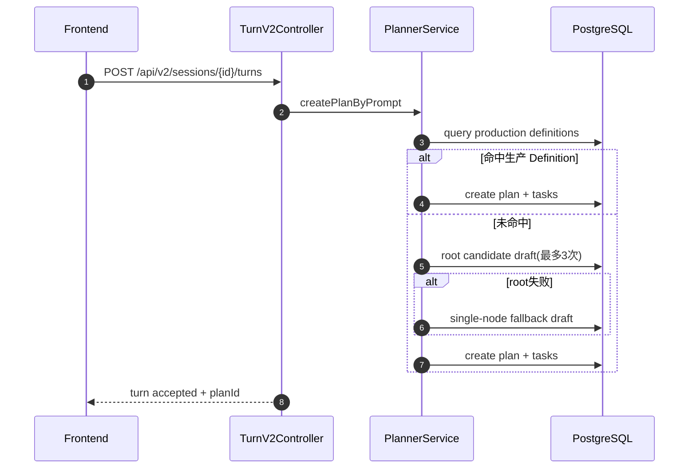
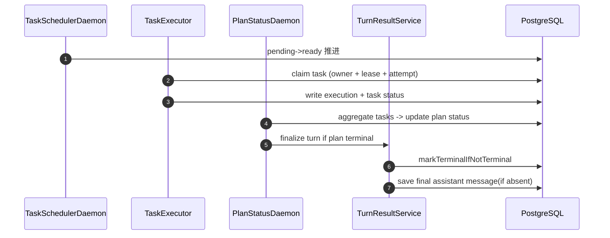
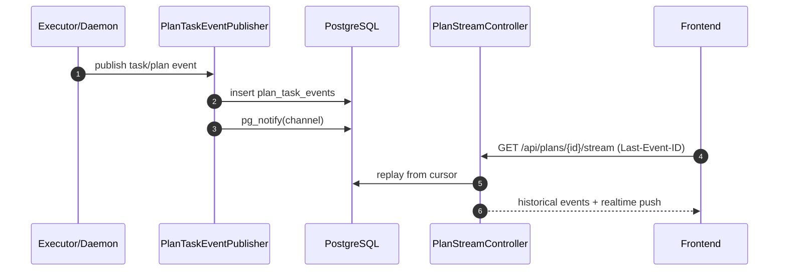

# 系统架构总览（Architecture）

## 1. 文档目标

本文档作为系统架构主文档，回答四个问题：

- 系统边界是什么（与哪些外部系统交互）
- 关键链路如何流转（会话 -> 规划 -> 执行 -> 收敛 -> 回放）
- 一致性如何保障（幂等、乐观锁、唯一约束、代际隔离）
- 出错时如何降级（重试、回放、兜底、告警）

## 2. 架构分层与系统边界

### 2.1 模块职责（DDD）

- `agent-app`：启动装配、配置加载、调度线程池、MyBatis 资源。
- `agent-trigger`：HTTP/SSE 入口与守护任务（调度、执行、聚合、流推送）。
- `agent-domain`：领域实体、状态机、仓储端口、核心语义。
- `agent-infrastructure`：DAO/Mapper、仓储实现、AI/MCP 适配、Planner 实现。
- `agent-api`：对外 DTO 与统一响应协议。
- `agent-types`：枚举、异常、常量。

### 2.2 外部边界（C4-L1 文字图）

```text
[Frontend Console]
      |
      v
[agent-trigger HTTP/SSE]
      |
      v
[domain services + state machines]
      |
      v
[infrastructure adapters] ---> [LLM Gateway / MCP / Vector Store]
      |
      v
[PostgreSQL]
```

边界原则：

- `trigger` 不直接操作 SQL。
- `domain` 不依赖 `infrastructure` 实现细节。
- 并发语义和状态迁移必须先在领域层定义，再落到仓储 SQL。

## 3. 统一术语与数据边界

- `Plan`：一次用户目标触发的执行编排实例（总任务）。
- `Task`：Plan 内节点任务（可被 claim 执行）。
- `Workflow Definition`：生产定义，版本不可变。
- `Workflow Draft`：候选草案与治理对象。
- `Routing Decision`：路由命中/兜底决策审计记录。
- `AgentProfile`：`agent_registry` 中的执行配置。
- `TaskClient`：运行时执行客户端（底层 `ChatClient`）。

数据库落地范围（必须跨进程恢复）：

- 会话与回合：`agent_sessions/session_turns/session_messages`
- 路由与执行：`workflow_definitions/workflow_drafts/routing_decisions/agent_plans/agent_tasks/task_executions`
- 事件流：`plan_task_events`
- Agent 配置：`agent_registry/agent_tool_catalog/agent_tools/vector_store_registry`

## 4. 核心链路时序（C4-L2 / Runtime）

### 4.1 会话触发与规划



### 4.2 调度执行与终态收敛



### 4.3 SSE 实时与回放



## 5. 一致性与并发策略

### 5.1 Plan/Task 乐观锁

- `agent_plans`、`agent_tasks` 使用 `version` 乐观锁。
- SQL 条件更新：`where id=? and version=?`。
- Java 侧禁止提前自增 version，避免写偏。

### 5.2 任务 claim 代际隔离

- claim 原子化写入 `claim_owner + lease_expire_at + execution_attempt`。
- 回写终态与续约必须携带 `claim_owner + execution_attempt` guard。
- 旧执行者回写被拒绝，防止跨实例覆盖。

### 5.3 回合终态幂等

- 终态收敛采用“先抢占终态，再写最终 assistant 消息”。
- `session_messages` 限制同一 turn 下 assistant 最终消息唯一（条件唯一索引）。
- finalize 结果语义：`FINALIZED / ALREADY_FINALIZED / SKIPPED_NOT_TERMINAL`。

### 5.4 SSE 游标一致性

- 游标优先级：`Last-Event-ID` > query `lastEventId`。
- 连接建立先回放，再实时订阅。
- 连接存活期执行 replay sweep 兜底，覆盖通知丢失。

## 6. 失败模式与降级策略

- Root 候选规划失败：最多 3 次重试，失败降级单节点 Draft。
- TaskClient 超时：按配置追加有限重试，超过上限进入 FAILED。
- Plan 黑板写回冲突：读取最新 Plan 后有限重试。
- SSE 通知丢失：依赖事件表回放补偿。

## 7. 可观测性与审计

### 7.1 指标基线（关键）

- 任务执行与过期运行：`agent.task.*`
- Plan 终态收敛：
  - `agent.plan.finalize.attempt.total`
  - `agent.plan.finalize.dedup.total`
  - `agent.plan.finished.publish.total`
- Planner 路由与兜底：
  - `agent.planner.route.total`（tag: `decision_type`）
  - `agent.planner.fallback.total`（tag: `reason`）
- SSE 实时与回放：
  - `agent.sse.push.attempt.total`
  - `agent.sse.push.fail.total`
  - `agent.sse.replay.batch.total`
  - `agent.sse.replay.hit.total`
  - `agent.sse.replay.empty.total`
  - `agent.sse.replay.events.total`
  - `agent.sse.replay.duration`

### 7.2 告警阈值（已固化）

已固化到 Prometheus 规则文件：

- `docs/dev-ops/observability/prometheus/planner-alert-rules.yml`
- `docs/dev-ops/observability/prometheus/executor-terminal-alert-rules.yml`
- `docs/dev-ops/observability/prometheus/sse-alert-rules.yml`

分级阈值：

- Planner（预发/生产）：fallback 绝对值、fallback 比例、指标断流。
- Executor/Terminal（预发/生产）：finalize dedup 比例、claimed update guard reject 比例、timeout 最终失败比例、指标断流。
- SSE（预发/生产）：推送失败比例、回放命中率、回放平均耗时、指标断流。

处置手册：

- `docs/dev-ops/observability/planner-alert-runbook.md`
- `docs/dev-ops/observability/executor-terminal-alert-runbook.md`
- `docs/dev-ops/observability/sse-alert-runbook.md`

### 7.3 HTTP 链路日志

- 入口统一日志：`HTTP_IN / HTTP_OUT / HTTP_ERROR`
- 全链路追踪字段：`X-Trace-Id`、`X-Request-Id`
- 关键审计事件：`ROUTING_DECIDED`、`TURN_FINALIZED`、`CHAT_V1_REJECTED`

## 8. 架构决策（ADR 摘要）

- ADR-001：Workflow 命中优先生产 Definition，未命中再 Root 候选。
- ADR-002：Root 不硬编码，启动即校验可用性。
- ADR-003：最终用户输出仅暴露 `WORKER`，`CRITIC` 仅用于内部校验。
- ADR-004：SSE 采用“事件持久化 + 通知广播 + 回放补偿”三层模型。
- ADR-005：终态收敛采用幂等语义，避免重复最终消息。

## 9. 与其他文档的映射

- 产品需求入口：`README.md`
- 前端 IA/UI 规范：`03-ui-ux-spec.md`
- 数据模型与 SQL：`docs/archive/design/07-data-model-and-sql.md`
- 观测与运维：`docs/archive/design/08-observability-and-ops.md`
- 开发任务清单：`04-development-backlog.md`

## 10. V2 会话与规划 API（已落地）

### 10.1 接口与链路定位

- `GET /api/v2/agents/active`：查询可用 Agent 列表。
- `POST /api/v2/agents`：创建 Agent。
- `POST /api/v2/sessions`：会话创建显式绑定 `agentKey`。
- `POST /api/v2/sessions/{id}/turns`：回合触发规划并返回路由决策摘要。
- `GET /api/v2/plans/{id}/routing`：返回路由决策详情（含 fallback 原因与重试次数）。

链路状态：

- 新链路：前端会话启动主路径已切换到 `/api/v2/*`。
- 兼容链路：旧 `/api/sessions/{id}/chat` 已硬下线，调用方需迁移到 V2。

### 10.2 路由决策关键字段语义

- `sourceType`：路由来源类型（如 production 命中、root candidate、auto fallback）。
- `fallbackFlag`：是否触发 fallback。
- `fallbackReason`：fallback 的结构化原因（如 `AUTO_MISS_FALLBACK`）。
- `plannerAttempts`：本轮 root 规划尝试次数。

### 10.3 持久化映射（V2 增量）

- `agent_sessions`：新增 `agent_key`、`scenario`，用于会话与 Agent 显式绑定及场景审计。
- `routing_decisions`：新增 `source_type`、`fallback_flag`、`fallback_reason`、`planner_attempts`。
- `session_messages`：历史数据强制收敛为“同一 turn 仅 1 条 assistant 最终消息”（并补齐唯一索引）。
- 对应迁移脚本：
  - `docs/dev-ops/postgresql/sql/migrations/V20260212_01_session_planner_v2.sql`
  - `docs/dev-ops/postgresql/sql/migrations/V20260212_01_session_planner_v2_rollback.sql`
  - `docs/dev-ops/postgresql/sql/migrations/V20260213_02_executor_terminal_convergence.sql`
  - `docs/dev-ops/postgresql/sql/migrations/V20260213_02_executor_terminal_convergence_rollback.sql`

### 10.4 查询层性能优化（本轮）

- `QueryController` 的任务聚合场景已从“逐任务查询 latestExecutionTimeMs”切换为批量查询。
- 仓储新增 `ITaskExecutionRepository#findLatestExecutionTimeByTaskIds`，由 MyBatis 单次 SQL 批量返回每个任务的最新执行耗时。
- 覆盖接口：`/api/tasks`、`/api/plans/{id}/tasks`、`/api/sessions/{id}/overview`、`/api/dashboard/overview`。
- 效果：消除任务列表的 N+1 查询，降低会话与看板页查询放大。

## 11. 下一阶段架构优化重点（P0）

- SSE 指标与告警已固化：推送失败率、回放命中率、回放平均耗时纳入规则与 runbook。
- 继续周期化执行并发 finalize 与 claim/lease 压测，按版本节奏校准阈值。
