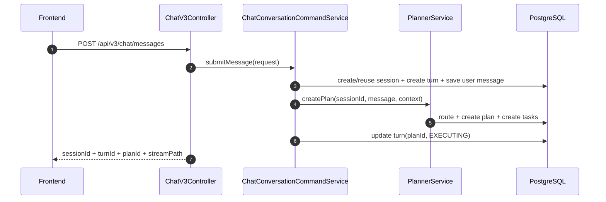

# 系统架构总览（Architecture）

## 1. 文档目标

本文档回答四个问题：

- 系统边界是什么（与哪些外部系统交互）
- 关键链路如何流转（会话 -> 规划 -> 执行 -> 收敛 -> 回放）
- 一致性如何保障（幂等、乐观锁、唯一约束、代际隔离）
- 出错时如何降级（重试、回放、兜底、告警）

## 2. 架构分层与系统边界

### 2.1 模块职责（DDD）

- `agent-app`：启动装配、配置加载、调度线程池、MyBatis 资源。
- `agent-trigger`：HTTP/SSE 入口适配 + `trigger.application` 用例编排（命令/查询/SSE语义映射）。
- `agent-domain`：领域实体、领域服务、状态机、仓储端口、核心语义。
- `agent-infrastructure`：DAO/Mapper、仓储实现、AI/MCP 适配、Planner 实现。
- `agent-api`：对外 DTO 与统一响应协议。
- `agent-types`：枚举、异常、常量。

### 2.2 外部边界（C4-L1 文字图）

```text
[Frontend Console]
      |
      v
[agent-trigger HTTP/SSE]
      |
      v
[domain services + state machines]
      |
      v
[infrastructure adapters] ---> [LLM Gateway / MCP / Vector Store]
      |
      v
[PostgreSQL]
```

边界原则：

- `trigger` 不直接操作 SQL。
- `domain` 不依赖 `infrastructure` 实现细节。
- 并发语义和状态迁移先在领域层定义，再落地仓储 SQL。
- 当前版本不引入登录与 RBAC；前端默认全功能可见可用。

## 3. 统一术语与数据边界

- `Plan`：一次用户目标触发的执行编排实例（总任务）。
- `Task`：Plan 内节点任务（可被 claim 执行）。
- `Workflow Definition`：生产定义，版本不可变。
- `Workflow Draft`：候选草案与治理对象。
- `Routing Decision`：路由命中/兜底决策审计记录。
- `AgentProfile`：`agent_registry` 中的执行配置。

数据库落地范围（必须跨进程恢复）：

- 会话与回合：`agent_sessions/session_turns/session_messages`
- 路由与执行：`workflow_definitions/workflow_drafts/routing_decisions/agent_plans/agent_tasks/task_executions`
- 事件流：`plan_task_events`
- Agent 配置：`agent_registry/agent_tool_catalog/agent_tools/vector_store_registry`

## 4. 核心链路时序（Runtime）

### 4.1 V3 会话编排入口



### 4.2 调度执行与终态收敛


### 4.3 聊天语义 SSE（V3）


### 4.4 路由决策查询（V3）

- `GET /api/v3/chat/plans/{id}/routing` 返回结构化路由决策。
- V2 路由查询入口已下线并返回迁移提示。

## 5. 一致性与并发策略

- 领域充血：`SessionTurnEntity`、`AgentPlanEntity`、`AgentTaskEntity` 新增状态迁移与 claim/lease 领域行为，应用层仅编排不写规则。
- 领域服务落位：`SessionConversationDomainService`、`PlanFinalizationDomainService`、`PlanTransitionDomainService`、`TaskDispatchDomainService`、`TaskExecutionDomainService`、`TaskPromptDomainService`、`TaskEvaluationDomainService`、`TaskRecoveryDomainService`、`TaskAgentSelectionDomainService` 承载会话策略、终态汇总、Plan 聚合迁移与 Task 执行/提示词/判定/回滚/Agent 选择策略规则。
- 兼容层清理：`trigger.service` 过渡包装类已删除，统一由 `trigger.application` 调用 domain。

### 5.1 Plan/Task 乐观锁

- `agent_plans`、`agent_tasks` 使用 `version` 乐观锁。
- SQL 条件更新：`where id=? and version=?`。

### 5.2 任务 claim 代际隔离

- claim 原子化写入 `claim_owner + lease_expire_at + execution_attempt`。
- 回写终态与续约必须携带 `claim_owner + execution_attempt` guard。

### 5.3 回合终态幂等

- 终态收敛采用“先抢占终态，再写最终 assistant 消息”。
- `session_messages` 限制同一 turn 下 assistant 最终消息唯一（条件唯一索引）。

### 5.4 SSE 游标一致性

- `Last-Event-ID` > query `lastEventId`。
- 连接建立先回放，再实时订阅。

## 6. 失败模式与降级策略

- Root 候选规划失败：最多 3 次重试，失败降级单节点 Draft。
- TaskClient 超时：按配置追加有限重试，超过上限进入 FAILED。
- Plan 黑板写回冲突：读取最新 Plan 后有限重试。
- SSE 通知丢失：依赖事件表回放补偿。
- V3 会话编排无可用 Agent：明确返回 `暂无可用 Agent`。

## 7. 可观测性与审计

- 入口日志：`HTTP_IN / HTTP_OUT / HTTP_ERROR`
- 关键审计事件：`ROUTING_DECIDED`、`TURN_FINALIZED`、`CHAT_V3_ACCEPTED`
- 告警规则：Planner / Executor-Terminal / SSE 已固化至 `docs/dev-ops/observability/prometheus/*`

## 8. 对外 API 分层策略

### 8.1 推荐（V3）

- `POST /api/v3/chat/messages`
- `GET /api/v3/chat/sessions/{id}/history`
- `GET /api/v3/chat/sessions/{id}/stream`
- `GET /api/v3/chat/plans/{id}/routing`

### 8.2 下线（V2）

- `GET /api/v2/agents/active`（已下线，返回迁移提示）
- `POST /api/v2/agents`（已下线，返回迁移提示）
- `POST /api/v2/sessions`（已下线，返回迁移提示）
- `POST /api/v2/sessions/{id}/turns`（已下线，返回迁移提示）
- `GET /api/v2/plans/{id}/routing`（已下线，返回迁移提示）

策略说明：

- 新前端仅走 V3 聚合协议。
- V2 编排接口全部下线，统一迁移到 V3。

## 9. 与其他文档的映射

- 产品需求：`docs/01-product-requirements.md`
- UI/UX 规范：`docs/03-ui-ux-spec.md`
- 开发任务清单：`docs/04-development-backlog.md`
