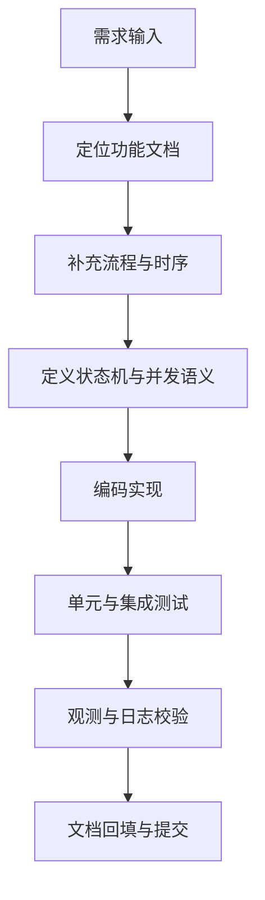

# 开发指南与任务清单（模块级）

## 1. 文档目标

- 建立统一开发流程：需求 -> 设计 -> 实现 -> 回归 -> 发布。
- 提供模块级任务清单：已完成 / 未完成 / 依赖 / 验收。
- 作为“阶段性复盘”后的执行基线，避免重复投入与偏题开发。

## 2. 开发流程基线

## 3. 模块级任务清单（含已完成/未完成）

> 说明：状态以 `2026-02-12` 会话与规划 V2 收口基线为准。

### 3.1 会话与规划模块（Session + Planner）

- 状态：`已完成（本轮升级）`
- 已完成：
  - 会话创建、回合触发、消息沉淀链路可用。
  - Workflow 命中优先 `PRODUCTION + ACTIVE`，未命中触发 Root 候选。
  - Root 重试 3 次失败后降级单节点候选 Draft。
  - 候选节点缺省 `agentId/agentKey` 可注入 fallback `assistant`。
  - 新增 V2 主链路：`/api/v2/sessions` + `/api/v2/sessions/{id}/turns`。
  - 新增 Agent 启动能力：`GET /api/v2/agents/active` + `POST /api/v2/agents`。
  - 新增路由决策详情查询：`/api/v2/plans/{id}/routing`，支持 sourceType/fallbackReason/plannerAttempts。
  - 已完成 V1 聊天接口硬下线：`POST /api/sessions/{id}/chat` 返回迁移提示。
  - 已补齐并通过 V2 控制器回归：`AgentV2ControllerTest`、`SessionV2ControllerTest`、`TurnV2ControllerTest`、`PlanRoutingV2ControllerTest`。
  - 已补齐 Planner 路由指标：`agent.planner.route.total` 与 `agent.planner.fallback.total`。
  - 已完成任务查询性能优化：`QueryController` 任务列表相关接口改为批量查询 `latestExecutionTimeMs`，消除 N+1。
  - 已固化 Planner 告警阈值规则：`docs/dev-ops/observability/prometheus/planner-alert-rules.yml`。
- 依赖：`agent_registry` 基线数据、Planner 配置可用性。
- 验收：
  - `PlannerServiceRootDraftTest` 通过；未命中场景可稳定产出候选计划。
  - `AgentV2ControllerTest`、`SessionV2ControllerTest`、`TurnV2ControllerTest`、`PlanRoutingV2ControllerTest` 通过。
  - `ChatControllerTest` 通过；旧接口调用返回迁移提示。

### 3.2 执行与终态收敛模块（Executor + Plan Status + Turn Result）

- 状态：`已完成（本轮收口）`
- 已完成：
  - Task claim/lease/executionAttempt 并发语义闭环。
  - Turn 终态收敛幂等：先抢占终态，再写最终消息。
  - 重复 finalize 去重，避免重复 assistant 最终消息。
  - Plan 推进新增 finalize attempt/dedup/publish 指标。
  - 新增并发回归：`ExecutorTerminalConvergenceIntegrationTest`（并发 finalize 单消息收敛 + reclaim 场景旧代回写拒绝）。
  - 新增线上增量迁移脚本：`V20260213_02_executor_terminal_convergence.sql`（含 rollback）。
  - 新增 Executor/Terminal 告警规则与 runbook：`executor-terminal-alert-rules.yml`。
- 持续动作（非功能缺口）：按发布节奏周期执行并发压测并校准告警阈值。
- 依赖：`session_messages` 唯一约束、Plan/Task 乐观锁一致语义。
- 验收：`TurnResultServiceTest`、`PlanStatusDaemonTest`、`ExecutorTerminalConvergenceIntegrationTest` 通过。

### 3.3 SSE 实时与回放模块

- 状态：`已完成（本轮收口）`
- 已完成：
  - 事件持久化 + `pg_notify/listen` + replay sweep 三层模型。
  - 游标优先级明确：`Last-Event-ID` > query `lastEventId`。
  - 会话页可实时消费任务事件并增量展示。
  - SSE 专项指标已补强：推送失败率、回放耗时、回放命中率。
  - SSE 告警规则与 runbook 已固化：`sse-alert-rules.yml`。
- 持续动作（非功能缺口）：跨实例网络抖动场景的常态化回归脚本继续完善。
- 依赖：`plan_task_events` 数据完整性、多实例通道配置一致。
- 验收：`SessionChatPlanSseIntegrationTest`（Docker 环境）通过。

### 3.4 观测与运维模块（Observability）

- 状态：`已完成（本轮收口）`
- 已完成：
  - HTTP 入口统一日志与 `traceId/requestId` 注入。
  - Dashboard 可展示 P95/P99、慢任务、SLA 违约数。
  - 关键审计事件与执行记录字段已落库。
  - 日志分页查询已改为 DB 侧过滤 + 计数 + 分页，避免内存全量扫描。
  - 新增观测告警目录接口：`GET /api/observability/alerts/catalog`。
  - 总览页支持告警目录展示与日志下钻（按 `level/taskId/keyword`）。
- 持续动作（非功能缺口）：告警目录中的 dashboard 链接需按环境替换为真实地址。
- 依赖：日志采样与脱敏配置、监控系统告警规则。
- 验收：任意失败请求可通过 `traceId` 关联入口日志与执行日志。

### 3.5 前端控制台主路径模块

- 状态：`已完成（按当前范围收口）`
- 已完成：
  - 一级导航 IA 重构完成（工作台/执行/任务/资产/观测/设置）。
  - 会话页、任务页、任务详情页主链路可用。
  - 统一页面骨架与状态组件（`PageHeader/StateView/StatusTag`）。
  - 会话启动器已打通“选择 Agent / 快速创建 Agent -> 创建 Session -> 创建 Turn”主路径。
  - 会话页支持展示路由决策摘要与 fallback 提示。
- 未完成（范围外）：
  - 登录与 RBAC 暂不纳入当前核心主线，待后续版本按业务需要再评估。
- 依赖：无 P0 级依赖。
- 验收：核心路径在 3 次点击内进入执行；失败态均可恢复。

### 3.6 分享与对外交付模块

- 状态：`已完成（能力可用，优先级下调）`
- 已完成：
  - 任务分享链接创建、列表、单条撤销、全部撤销。
  - 匿名分享读取、token/code 校验、撤销与过期处理。
- 未完成：
  - 暂无 P0 缺口；后续仅做安全与体验小步优化。
- 依赖：`app.share.*` 配置、匿名读取接口稳定性。
- 验收：分享链路集成测试（Docker）通过。

## 4. 开发检查清单（实现前）

- 是否明确了状态机迁移与失败语义。
- 是否明确并发 guard 条件（owner/attempt/version）。
- 是否新增配置默认值并写入文档。
- 是否补充可观测指标与关键审计日志。
- 是否同步更新 SQL、Mapper、DTO、文档。

## 5. 回归测试清单（执行后）

### 5.1 功能回归

- 会话创建与回合触发规划。
- V2：Agent 创建 -> Session 启动 -> Turn 触发规划。
- V2：`GET /api/v2/plans/{id}/routing` 可返回 sourceType/fallbackReason/plannerAttempts。
- 旧接口 `/api/sessions/{id}/chat` 调用应返回“已下线，请使用 V2”提示。
- `overview` 聚合返回完整。
- 任务依赖推进、执行完成、失败重试。
- Plan 自动闭环与 turn 最终回复正确。
- 分享创建/撤销/过期/匿名访问全链路。

### 5.2 并发回归

- 多实例并发 claim。
- lease 过期重领。
- 旧执行者回写拒绝。
- 乐观锁冲突恢复。
- SSE 断线重连回放一致。
- 重复 finalize 幂等。

### 5.3 观测回归

- 关键指标可见。
- 审计日志可定位。
- `traceId` 可串联入口与执行链路。
- Prometheus 规则语法与单测应可通过（`promtool check rules` / `promtool test rules`）。

## 6. 命令基线

- 联编校验：`mvn -pl agent-app -am -DskipTests test-compile`
- 核心单测：
  - `mvn -pl agent-app -am -DskipTests=false -Dtest=PlannerServiceRootDraftTest -Dsurefire.failIfNoSpecifiedTests=false test`
  - `mvn -pl agent-app -am -DskipTests=false -Dtest=AgentV2ControllerTest,SessionV2ControllerTest,TurnV2ControllerTest,PlanRoutingV2ControllerTest -Dsurefire.failIfNoSpecifiedTests=false test`
  - `mvn -pl agent-app -am -DskipTests=false -Dtest=ChatControllerTest -Dsurefire.failIfNoSpecifiedTests=false test`
  - `mvn -pl agent-app -am -DskipTests=false -Dtest=TaskExecutorPlanBoundaryTest -Dsurefire.failIfNoSpecifiedTests=false test`
  - `mvn -pl agent-app -am -DskipTests=false -Dtest=TurnResultServiceTest -Dsurefire.failIfNoSpecifiedTests=false test`
  - `mvn -pl agent-app -am -DskipTests=false -Dtest=PlanStatusDaemonTest -Dsurefire.failIfNoSpecifiedTests=false test`
  - `mvn -pl agent-app -am -DskipTests=false -Dtest=PlanStreamControllerTest,ConsoleQueryControllerPerformanceTest,ObservabilityAlertCatalogControllerTest -Dsurefire.failIfNoSpecifiedTests=false test`
  - `promtool check rules docs/dev-ops/observability/prometheus/planner-alert-rules.yml`
  - `promtool test rules docs/dev-ops/observability/prometheus/planner-alert-rules.test.yml`
  - `promtool check rules docs/dev-ops/observability/prometheus/executor-terminal-alert-rules.yml`
  - `promtool test rules docs/dev-ops/observability/prometheus/executor-terminal-alert-rules.test.yml`
  - `promtool check rules docs/dev-ops/observability/prometheus/sse-alert-rules.yml`
  - `promtool test rules docs/dev-ops/observability/prometheus/sse-alert-rules.test.yml`
- Docker 集成回归：
  - `mvn -pl agent-app -am -DskipTests=false -Dit.docker.enabled=true -Dtest=SessionChatPlanSseIntegrationTest -Dsurefire.failIfNoSpecifiedTests=false test`
  - `mvn -pl agent-app -am -DskipTests=false -Dit.docker.enabled=true -Dtest=ExecutorTerminalConvergenceIntegrationTest -Dsurefire.failIfNoSpecifiedTests=false test`
  - `mvn -pl agent-app -am -DskipTests=false -Dit.docker.enabled=true -Dtest=TaskShareLinkControllerIntegrationTest,ShareAccessControllerIntegrationTest -Dsurefire.failIfNoSpecifiedTests=false test`

## 7. 下一轮系统优化计划（按优先级）

### P0：核心链路稳定性（当前主线）

- 持续观察 SSE/Planner/Executor 告警命中效果并按发布节奏调优阈值。

### P1：前端核心业务补齐

- 固化 V2 主链路运维发布规范（灰度检查、告警阈值、回滚手册）。
- 继续聚焦会话/规划/执行/监控主链路，不扩展权限与登录子系统。

### P2：体验优化

- 分享功能保守迭代，不占用 P0/P1 资源。
- 持续统一视觉细节与键盘可达性。
