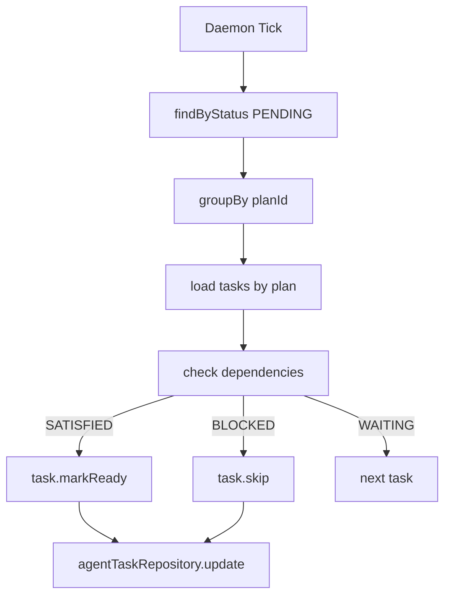
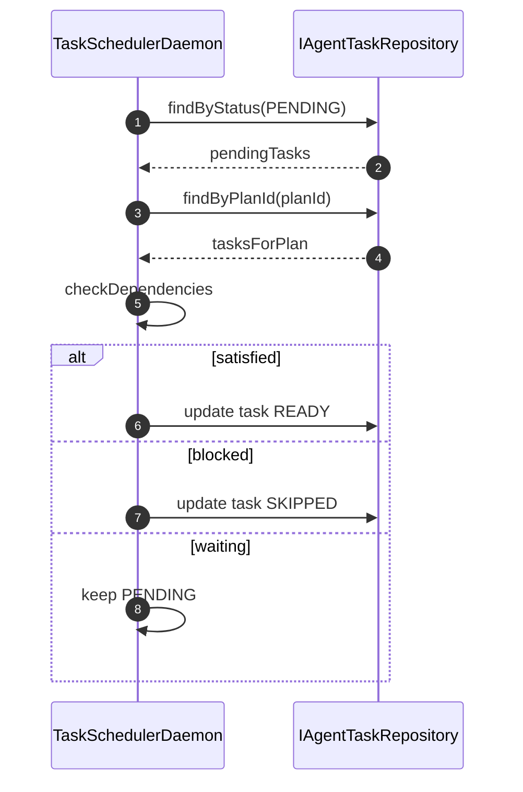

# 功能文档：任务依赖调度

## 1. 功能目标

- 周期扫描 `PENDING` 任务。
- 根据依赖节点状态推进任务到 `READY`。
- 依赖失败时将下游任务标记为 `SKIPPED`。

## 2. 业务流程图

## 3. 时序图

## 4. 关键实现定位

- `agent-trigger/src/main/java/com/getoffer/trigger/job/TaskSchedulerDaemon.java`
- `agent-domain/src/main/java/com/getoffer/domain/task/model/entity/AgentTaskEntity.java`
- `agent-domain/src/main/java/com/getoffer/domain/task/adapter/repository/IAgentTaskRepository.java`

## 5. 配置项

- `scheduler.poll-interval-ms`，默认 `1000`。
- 调度线程池使用 `daemonScheduler`，配置在 `scheduling.daemon.*`。

## 6. 状态推进规则

- 依赖全部 `COMPLETED`：`PENDING -> READY`
- 任一依赖 `FAILED` 或 `SKIPPED`：`PENDING -> SKIPPED`
- 其他状态：保持 `PENDING`

## 7. 开发要点

- 依赖关系基于 `dependencyNodeIds` 与 `nodeId` 映射。
- 批量扫描时按 `planId` 聚合，避免重复查询。
- 更新失败要记录日志但不阻断本轮其他任务推进。

## 8. 测试场景

1. 无依赖任务可直接推进 READY。
2. 上游全部 COMPLETED 时推进 READY。
3. 上游存在 FAILED 时推进 SKIPPED。
4. 上游仍在 RUNNING 时保持 PENDING。
