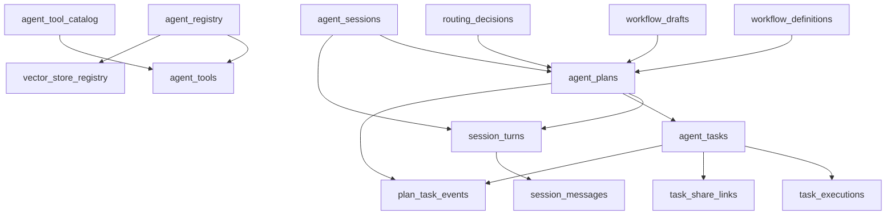
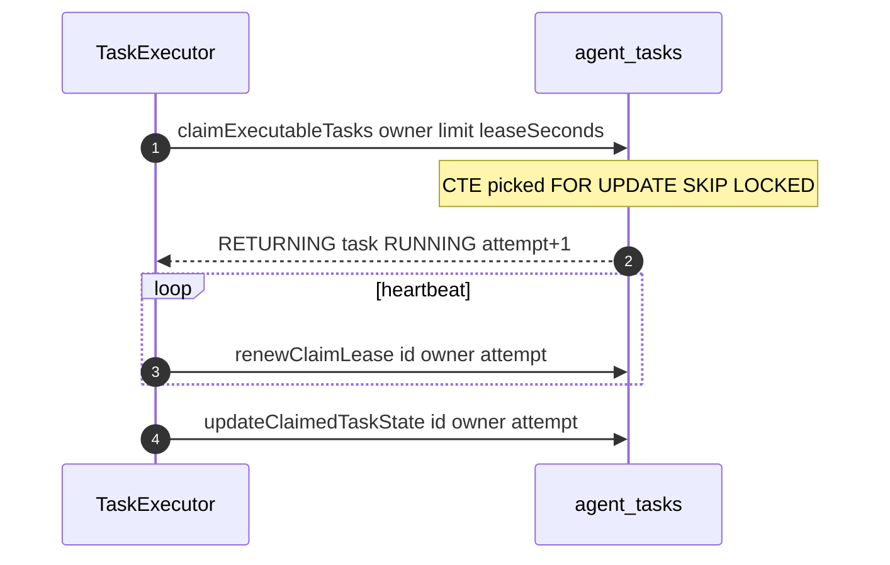

# 功能文档：数据模型与关键 SQL

## 1. 功能目标

- 明确核心表之间的数据关系。
- 标注关键状态字段和并发字段。
- 固化 claim 与聚合统计 SQL 的语义边界。
- 固化 `routing_decisions + agent_plans + agent_tasks` 原子写入约束。

## 2. 核心数据模型

主要表：
- `agent_sessions`
- `session_turns`
- `session_messages`
- `workflow_definitions`
- `workflow_drafts`
- `routing_decisions`
- `agent_plans`
- `agent_tasks`
- `task_executions`
- `task_share_links`
- `plan_task_events`
- `agent_registry`
- `agent_tool_catalog`
- `agent_tools`
- `vector_store_registry`

术语对应：
- `workflow_definitions`：生产 Workflow Definition（版本不可变）。
- `workflow_drafts`：运行时 Draft 与治理对象。
- `routing_decisions`：路由命中/兜底审计记录。
- `agent_registry`：`AgentProfile` 配置表（不是 Plan，也不是一次执行会话）。
- `TaskClient`：运行态对象，不持久化到数据库。

## 2.1 数据库落地范围

“数据库落地范围”指必须持久化并可跨实例恢复的数据边界，当前包括：
- 会话链路：`agent_sessions/session_turns/session_messages`
- 路由与规划执行链路：`workflow_definitions/workflow_drafts/routing_decisions/agent_plans/agent_tasks/task_executions/task_share_links`
- 事件链路：`plan_task_events`
- Agent 配置链路：`agent_registry/agent_tool_catalog/agent_tools/vector_store_registry`

不属于落地范围的运行态对象（如 `TaskClient`、线程池上下文）仅以内存形式存在。

## 3. 数据关系图

## 4. claim 关键 SQL 时序

## 5. 并发关键字段

`routing_decisions`：
- `decision_type`
- `strategy`
- `score`
- `reason`
- `definition_id/definition_version`
- `draft_id`

`agent_plans`：
- `route_decision_id`（非空，外键）
- `workflow_definition_id`
- `workflow_draft_id`
- `execution_graph`（执行事实源）
- `definition_snapshot`（审计解释）
- `status`
- `version`

`agent_tasks`：
- `status`
- `version`
- `claim_owner`
- `claim_at`
- `lease_until`
- `execution_attempt`
- `task_type`（`task_type_enum`）

`task_executions`：
- `attempt_number`
- `execution_time_ms`
- `model_name`
- `token_usage`
- `error_type`

`task_share_links`：
- `task_id`
- `share_code`
- `token_hash`
- `expires_at`
- `revoked/revoked_at/revoked_reason`
- `scope`

`plan_task_events`：
- `id`（事件游标）
- `plan_id`
- `task_id`
- `event_type`
- `event_data`

`session_turns`：
- `status`（`CREATED/PLANNING/EXECUTING/SUMMARIZING/COMPLETED/FAILED/CANCELLED`）
- `plan_id`（唯一索引，非空时唯一）
- `final_response_message_id`

`session_messages`：
- `role`（`USER/ASSISTANT/SYSTEM/TOOL`）
- `turn_id`
- `content`
- 约束：`turn_id + role=ASSISTANT` 唯一（同一回合仅保留 1 条最终 Assistant 回复）

`workflow_definitions`：
- `definition_key`
- `tenant_id`
- `version`
- `status`（`ACTIVE/DISABLED/ARCHIVED`）
- `route_description`
- `node_signature`
- `published_from_draft_id`
- `approved_by/approved_at`

`workflow_drafts`：
- `draft_key`
- `status`（`DRAFT/REVIEWING/PUBLISHED/ARCHIVED`）
- `dedup_hash`
- `source_type`
- `source_definition_id`
- `approved_by/approved_at`

## 6. 关键 SQL 入口

- `agent-app/src/main/resources/mybatis/mapper/AgentPlanMapper.xml`
  - `insert`
  - `updateWithVersion`
  - `selectByStatusPaged`
- `agent-app/src/main/resources/mybatis/mapper/AgentTaskMapper.xml`
  - `claimExecutableTasks`
  - `renewClaimLease`
  - `updateClaimedTaskState`
  - `selectPlanStatusStats`
- `agent-app/src/main/resources/mybatis/mapper/TaskExecutionMapper.xml`
  - `insert`
  - `getMaxAttemptNumber`
- `agent-app/src/main/resources/mybatis/mapper/TaskShareLinkMapper.xml`
  - `insert`
  - `selectByTaskIdAndShareCode`
  - `revokeById/revokeAllByTaskId`
- `agent-app/src/main/resources/mybatis/mapper/PlanTaskEventMapper.xml`
  - `insert`
  - `selectByPlanIdAfterEventId`
- `agent-app/src/main/resources/mybatis/mapper/SessionTurnMapper.xml`
  - `insert`
  - `update`
  - `updateToTerminalIfNotTerminal`
  - `bindFinalResponseMessageIfAbsent`
  - `selectByPlanId`
- `agent-app/src/main/resources/mybatis/mapper/SessionMessageMapper.xml`
  - `insert`
  - `selectFinalAssistantByTurnId`
  - `selectLatestAssistantByTurnId`
  - `selectBySessionId`
- `agent-app/src/main/resources/mybatis/mapper/WorkflowDefinitionMapper.xml`
  - `selectByStatus`
  - `selectLatestByTenantAndDefinitionKey`
- `agent-app/src/main/resources/mybatis/mapper/WorkflowDraftMapper.xml`
  - `selectByStatus`
  - `selectLatestByDedupHash`
- `agent-app/src/main/resources/mybatis/mapper/RoutingDecisionMapper.xml`
  - `insert`
  - `selectById`

## 7. 索引与性能关注点

- claim 扫描索引：`status lease_until plan_id created_at`
- owner 续约索引：`claim_owner lease_until`
- 聚合统计建议按 `plan_id` 优化访问路径
- SSE 事件回放索引：`plan_task_events(plan_id, id)`
- Turn 查询索引：`session_turns(session_id, id DESC)`
- 对话消息索引：`session_messages(session_id, id)`
- 最终回复去重索引：`session_messages(turn_id, role)`（`role='ASSISTANT'` 条件唯一索引）
- Definition 路由索引：`tenant_id status category name version DESC`
- Draft 去重索引：`tenant_id dedup_hash status`
- 路由审计索引：`session_id turn_id id DESC`

## 8. 开发要点

- SQL 方言以 PostgreSQL 为准，避免维护误导性的异构方言脚本。
- 修改字段后同步更新：
  - PO
  - Entity
  - Mapper XML
  - Repository 转换逻辑
- 并发路径改动必须验证 guard 条件仍完整生效。
- `execution_graph` 是执行事实源，`definition_snapshot` 仅用于审计解释。
- PostgreSQL SQL 目录仅维护最终版：`01_init_database.sql`。

## 9. 最终版 SQL

- `docs/dev-ops/postgresql/sql/01_init_database.sql`

## 10. 初始化执行建议

- 空库初始化：可直接执行 `01_init_database.sql`。
- 已有历史结构时，建议先重建 `public schema` 再执行最终版脚本，避免旧结构与 `DROP TYPE ... CASCADE` 产生连带影响。
- 初始化后至少校验：
  - 关键表：`session_turns/session_messages/routing_decisions/agent_plans/agent_tasks/task_share_links/plan_task_events`
  - 关键枚举：`turn_status_enum/message_role_enum/plan_status_enum/task_status_enum/task_type_enum/routing_decision_type_enum`
  - 基线数据：
    - `agent_registry` 至少包含 `assistant` 与 `root` 两个激活 profile
    - `workflow_definitions` 至少一条示例模板

## 11. 测试场景

1. 乐观锁更新成功与冲突路径。
2. claim 领取、续约、终态回写全链路。
3. 过期任务重领行为与回写保护。
4. 聚合查询在大批量 `planIds` 下性能与正确性。
5. SSE 断线重连可通过 `lastEventId` 回放事件。
6. Plan 终态后可在 `session_turns/session_messages` 查询到 Assistant 最终回复。
7. 未命中生产 Definition 时自动沉淀 Draft，并可通过治理 API 发布为新版本 Definition。
8. `routing_decisions + agent_plans + agent_tasks` 原子提交失败时可整体回滚。
