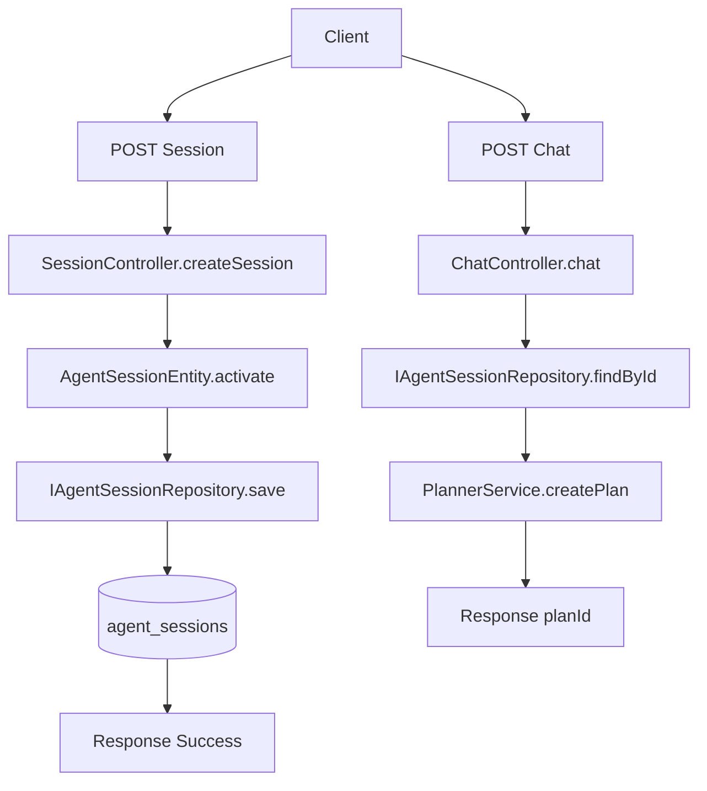
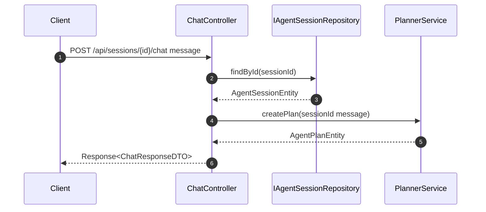

# 功能文档：会话创建与聊天触发规划

## 1. 功能目标

- 创建用户会话并持久化。
- 接收用户消息，触发规划流程，返回 `planId`。
- 提供统一响应体，便于前端和调用方接入。

## 2. 功能边界

包含：
- `POST /api/sessions`
- `POST /api/sessions/{id}/chat`

不包含：
- Task 调度与执行（见 `03`、`04`）
- Plan 状态聚合推进（见 `05`）

## 3. 业务流程图

## 4. 时序图

## 5. 关键实现定位

- `agent-trigger/src/main/java/com/getoffer/trigger/http/SessionController.java`
- `agent-trigger/src/main/java/com/getoffer/trigger/http/ChatController.java`
- `agent-domain/src/main/java/com/getoffer/domain/session/adapter/repository/IAgentSessionRepository.java`
- `agent-domain/src/main/java/com/getoffer/domain/planning/service/PlannerService.java`

## 6. 输入输出约束

- `SessionCreateRequestDTO.userId` 必填。
- `ChatRequestDTO.message` 必填。
- `chat` 接口在 session 不存在时返回参数错误码。
- 返回体统一为 `Response<T>`，成功码由 `ResponseCode.SUCCESS` 提供。

## 7. 开发要点

- Controller 仅做参数校验和流程编排，不承载业务规则。
- 规划失败要保留错误信息，方便调用方定位。
- DTO 变更属于外部契约变更，需同步更新调用方和文档。

## 8. 测试场景

1. 创建会话成功。
2. 缺少 `userId` 创建失败。
3. 会话不存在时触发聊天失败。
4. 规划服务抛错时响应为失败码并返回错误信息。
