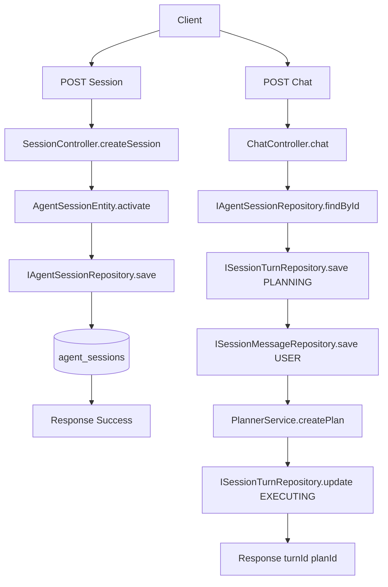
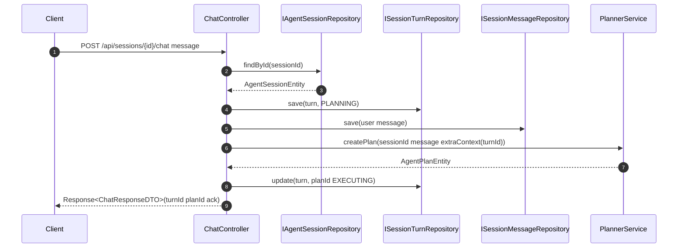

# 功能文档：会话创建与聊天触发规划

## 1. 功能目标

- 创建用户会话并持久化。
- 接收用户消息，创建 `Turn` 和 `Message`，触发规划流程。
- 在 Plan 完成后生成 Assistant 最终消息，形成可回放对话时间线。
- 提供统一响应体，便于前端和调用方接入。

## 2. 功能边界

包含：
- `POST /api/sessions`
- `POST /api/sessions/{id}/chat`
- `GET /api/sessions/{id}/turns`
- `GET /api/sessions/{id}/messages`
- `GET /api/sessions/{id}`（会话详情）
- `GET /api/sessions/{id}/plans`（会话下计划列表）
- `GET /api/sessions/{id}/overview`（会话首屏聚合）
- `GET /api/plans/{id}`（计划详情）
- `GET /api/plans/{id}/tasks`（计划任务列表）
- `GET /api/tasks/{id}/executions`（任务执行历史）
- 会话页“未命中生产 Definition”提示与 Draft 快速治理入口（查看、编辑、发布）

不包含：
- Task 调度与执行（见 `03`、`04`）
- Plan 状态聚合推进（见 `05`）

## 3. 业务流程图

## 4. 时序图

## 5. 关键实现定位

- `agent-trigger/src/main/java/com/getoffer/trigger/http/SessionController.java`
- `agent-trigger/src/main/java/com/getoffer/trigger/http/ChatController.java`
- `agent-domain/src/main/java/com/getoffer/domain/session/adapter/repository/IAgentSessionRepository.java`
- `agent-domain/src/main/java/com/getoffer/domain/session/adapter/repository/ISessionTurnRepository.java`
- `agent-domain/src/main/java/com/getoffer/domain/session/adapter/repository/ISessionMessageRepository.java`
- `agent-domain/src/main/java/com/getoffer/domain/planning/service/PlannerService.java`
- `agent-trigger/src/main/java/com/getoffer/trigger/service/TurnResultService.java`
- `agent-trigger/src/main/java/com/getoffer/trigger/http/QueryController.java`
- `frontend/src/pages/ConversationPage.tsx`
- `agent-trigger/src/main/java/com/getoffer/trigger/http/WorkflowGovernanceController.java`

## 6. 输入输出约束

- `SessionCreateRequestDTO.userId` 必填。
- `ChatRequestDTO.message` 必填。
- `ChatRequestDTO.extraContext` 可选，会并入 Plan 全局上下文。
- `chat` 接口在 session 不存在时返回参数错误码。
- `ChatResponseDTO` 包含 `turnId/planId/turnStatus/assistantMessage`。
- 返回体统一为 `Response<T>`，成功码由 `ResponseCode.SUCCESS` 提供。
- 查询接口约束：
  - `GET /api/sessions/{id}/plans` 返回会话下全部 Plan 摘要，前端可按 `updatedAt` 自行排序。
  - `GET /api/sessions/{id}/overview` 由后端按 `updatedAt` 倒序选择最新 Plan，返回 `latestPlanId/latestPlanTaskStats/latestPlanTasks`。
  - `GET /api/plans/{id}/tasks` 返回任务的执行态字段（`status/claimOwner/leaseUntil/executionAttempt`），用于页面展示实时执行上下文。
  - `GET /api/tasks/{id}/executions` 返回按 attempt 顺序的执行历史，包含 `modelName/tokenUsage/errorType/executionTimeMs`。

## 6.1 页面首屏建议调用顺序

1. 优先调用 `GET /api/sessions/{id}/overview` 构建首屏。
2. 若用户切换历史 Plan，再调用 `GET /api/plans/{id}` 与 `GET /api/plans/{id}/tasks`。
3. 进入任务详情抽屉/侧栏时调用 `GET /api/tasks/{id}/executions`。
4. 首屏基线加载后再连接 SSE，避免“先收事件后缺基线数据”的渲染抖动。

## 6.2 未命中 Definition 的前端治理交互

1. 会话页加载 `PlanDetail` 后，基于 `globalContext`（含 `workflowDraftId/draftKey/routeType/sourceType` 等字段）判断是否为 Draft 执行。
2. 命中 Draft 时展示告警提示，并提供“查看/编辑 Draft”按钮。
3. 点击后加载 Draft 详情并进入编辑抽屉，允许修改核心字段（名称、路由描述、图定义等）。
4. 支持两种操作：
   - 保存草案：调用 `PUT /api/workflows/drafts/{id}`。
   - 发布为生产 Definition：调用 `POST /api/workflows/drafts/{id}/publish`。

## 7. 开发要点

- Controller 负责参数校验与编排，Turn/Message 由仓储落库保证对话可追踪。
- 回合状态建议遵循：`PLANNING -> EXECUTING -> COMPLETED/FAILED`，失败路径也要回填 Assistant 消息，避免前端出现“无答复”空洞。
- Task 执行调用超时需进入失败收敛：默认超时重试 1 次，连续超时时应推动 `Task -> Plan -> Turn` 全链路失败终态。
- Plan 完成或失败后，通过 `TurnResultService` 生成最终 Assistant 文本并回填 `session_turns`。
- 完成态汇总仅采集 `TaskType=WORKER` 且 `status=COMPLETED` 的输出；`CRITIC` 输出仅用于校验与回滚，不直接透传给用户。
- 规划失败要保留错误信息，方便调用方定位。
- DTO 变更属于外部契约变更，需同步更新调用方和文档。

## 8. 测试场景

1. 创建会话成功。
2. 缺少 `userId` 创建失败。
3. 会话不存在时触发聊天失败。
4. 规划服务抛错时，Turn 标记 FAILED 且写入 Assistant 失败消息。
5. Plan 完成后能查询到对应 Turn 的 `assistantSummary` 与 Assistant 消息。
6. 进入页面后可通过查询 API 拉取会话、计划、任务与执行记录并完成首屏渲染。
7. 首屏聚合接口可一次返回会话、计划列表、最新计划任务统计与任务清单。
8. 当会话无计划时，`overview` 返回空 plans、空 task 列表与零值统计，不抛异常。
9. 含 `CRITIC` 节点的 Plan 完成后，最终 Assistant 消息不包含 `{"pass":...}` 这类校验 JSON。
10. 模拟 Task 调用连续超时时，Turn 应由守护流程收敛到 `FAILED`，并生成失败提示消息。
