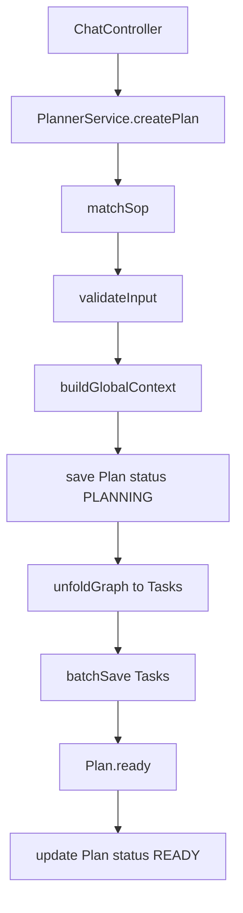
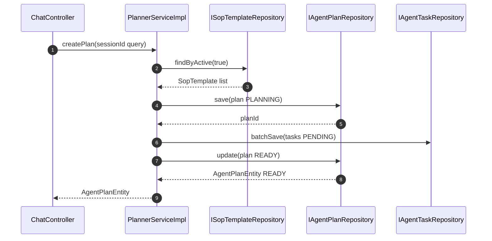

# 功能文档：SOP 匹配与 Plan 生成

## 1. 功能目标

- 根据用户输入匹配 SOP 模板。
- 生成 Plan 与 Task 初始数据。
- 完成 `PLANNING -> READY` 的建图闭环。

## 2. 业务流程图

## 3. 时序图

## 4. 关键实现定位

- `agent-infrastructure/src/main/java/com/getoffer/infrastructure/planning/PlannerServiceImpl.java`
  - `matchSop`
  - `createPlan`
  - `unfoldGraph`
- `agent-domain/src/main/java/com/getoffer/domain/planning/model/entity/AgentPlanEntity.java`
- `agent-domain/src/main/java/com/getoffer/domain/task/model/entity/AgentTaskEntity.java`
- `agent-app/src/main/resources/mybatis/mapper/AgentPlanMapper.xml`
- `agent-app/src/main/resources/mybatis/mapper/AgentTaskMapper.xml`

## 5. 数据与状态变化

- `agent_plans`
  - 新增一条 `PLANNING` 记录，再更新为 `READY`。
- `agent_tasks`
  - 按 DAG 节点批量插入，初始为 `PENDING`。
- `global_context`
  - 合并用户输入与 SOP 元信息，作为后续执行黑板。

## 6. 并发与一致性

- `createPlan` 使用事务，保证 Plan 与 Task 构建一致提交。
- Plan 更新使用乐观锁版本字段。
- Task 插入时 `execution_attempt` 初始为 0，后续由 claim 递增。

## 7. 开发要点

- 新增 SOP 字段时，优先扩展 `PlannerServiceImpl` 的输入解析和校验逻辑。
- 任务节点必须有稳定 `nodeId`，用于依赖匹配与唯一约束。
- 默认重试次数来自 `max_retries`，未配置时走默认值。

## 8. 测试场景

1. 匹配到 SOP 时生成 Plan 和 Task 成功。
2. 无匹配 SOP 时返回业务异常。
3. 输入缺少 required 字段时返回参数异常。
4. 图中无可执行节点时创建失败。
