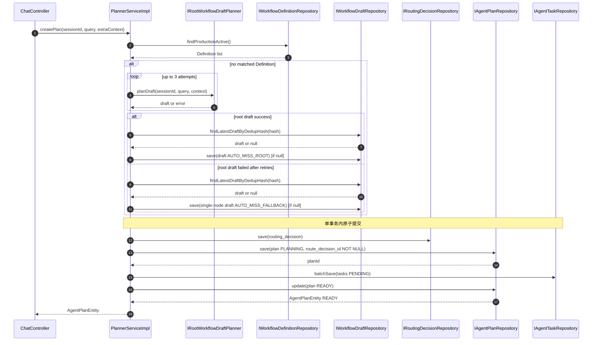

# 功能文档：Workflow 路由与 Plan 生成

## 1. 功能目标

- 根据用户输入进行 Workflow 路由决策（优先命中生产 Definition）。
- 未命中生产 Definition 时优先由 `root` 生成 Draft；失败重试 3 次后降级为单节点 Draft。
- 在同一事务内原子写入 `routing_decisions + agent_plans + agent_tasks`。
- 完成 `PLANNING -> READY` 的建图闭环，并保证 `execution_graph` 为唯一执行事实源。

## 2. 业务流程图

```mermaid
flowchart TD
    A[ChatController] --> B[PlannerService.createPlan]
    B --> C[route(PRODUCTION ACTIVE)]
    C -->|missed| C1[rootDraftPlanning retry x3]
    C1 -->|success| C2[persistOrReuseDraft AUTO_MISS_ROOT]
    C1 -->|failed| C3[fallback single-node draft AUTO_MISS_FALLBACK]
    C -->|matched| D[validateInput]
    C2 --> D
    C3 --> D
    D --> E[buildGlobalContext]
    E --> F[save RoutingDecision]
    F --> G[save Plan status PLANNING]
    G --> H[unfoldGraph to Tasks]
    H --> I[batchSave Tasks]
    I --> J[Plan.ready]
    J --> K[update Plan status READY]
```

## 3. 时序图



## 4. 关键实现定位

- `agent-infrastructure/src/main/java/com/getoffer/infrastructure/planning/PlannerServiceImpl.java`
  - `route`
  - `createPlan`
  - `routeAndResolve`
  - `persistOrReuseDraft`
  - `buildRoutingDecisionEntity`
  - `buildDefinitionSnapshot`
  - `unfoldGraph`
- `agent-infrastructure/src/main/java/com/getoffer/infrastructure/planning/RootWorkflowDraftPlannerImpl.java`
- `agent-trigger/src/main/java/com/getoffer/trigger/http/WorkflowGovernanceController.java`
- `agent-domain/src/main/java/com/getoffer/domain/planning/model/entity/AgentPlanEntity.java`
- `agent-domain/src/main/java/com/getoffer/domain/task/model/entity/AgentTaskEntity.java`
- `agent-app/src/main/resources/mybatis/mapper/AgentPlanMapper.xml`
- `agent-app/src/main/resources/mybatis/mapper/WorkflowDefinitionMapper.xml`
- `agent-app/src/main/resources/mybatis/mapper/WorkflowDraftMapper.xml`
- `agent-app/src/main/resources/mybatis/mapper/RoutingDecisionMapper.xml`

## 5. 数据与状态变化

- `routing_decisions`
  - 先写入一条路由决策，记录 `HIT_PRODUCTION/CANDIDATE/FALLBACK` 及原因。
- `agent_plans`
  - 新增一条 `PLANNING`，强关联 `route_decision_id`，再更新为 `READY`。
  - `definition_snapshot` 仅用于审计解释，不作为执行事实。
- `agent_tasks`
  - 按 `execution_graph` 节点批量插入，初始为 `PENDING`。
- `workflow_drafts`
  - 未命中时新增 Draft 记录：`status=DRAFT`。
  - `source_type`：
    - `AUTO_MISS_ROOT`：Root 规划成功生成。
    - `AUTO_MISS_FALLBACK`：Root 连续失败后降级生成。

## 6. 并发与一致性

- `createPlan` 使用事务，保证 `routing_decisions + agent_plans + agent_tasks` 一致提交。
- Plan 更新使用乐观锁版本字段。
- `route_decision_id` 非空且外键约束，避免半记录。
- Task 插入时 `execution_attempt` 初始为 0，后续由 claim 递增。

## 7. 开发要点

- `execution_graph` 是唯一执行事实源；调度与回放只依赖它。
- `definition_snapshot` 仅用于审计与解释，不参与执行分支判断。
- 任务节点必须有稳定 `nodeId`，用于依赖匹配与唯一约束。
- Root 规划草案会在规划阶段校验节点 `agentKey/agentId`，缺省时自动注入 fallback `agentKey`。
- fallback `agentKey` 来源于 `planner.root.fallback.agent-key`，默认值为 `assistant`（而非 `root`）。
- 服务启动时会执行 Root Agent 健康检查（`RootAgentHealthCheckRunner`），若 `planner.root.enabled=true` 且 `agent_registry` 中缺少/禁用了 `rootAgentKey`，启动直接失败。

## 8. 测试场景

1. 命中 Definition 时生成 Plan 和 Task 成功。
2. 无匹配 Definition 且 Root 草案生成成功，Draft `source_type=AUTO_MISS_ROOT`。
3. 无匹配 Definition 且 Root 连续失败 3 次，降级单节点 Draft `source_type=AUTO_MISS_FALLBACK`。
4. 输入缺少 required 字段时返回参数异常。
5. 图中无可执行节点时创建失败。
6. 候选草案节点未声明 `agentId/agentKey` 时，能自动注入 fallback `agentKey=assistant` 并通过校验。
7. 事务回滚路径：`routing_decision/plan/tasks` 任一步失败应整体回滚。

## 9. Workflow Draft 编辑与发布

- 针对未命中生产 Definition 的回合，前端会基于 Plan 的 `globalContext` 展示 Draft 治理入口。
- Draft 治理接口：
  - `GET /api/workflows/drafts`
  - `GET /api/workflows/drafts/{id}`
  - `PUT /api/workflows/drafts/{id}`
  - `POST /api/workflows/drafts/{id}/publish`
- Definition 查询接口：
  - `GET /api/workflows/definitions`
  - `GET /api/workflows/definitions/{id}`
- 发布语义：Draft 发布创建 `version+1` Definition，并将 Draft 标记为 `PUBLISHED`。
