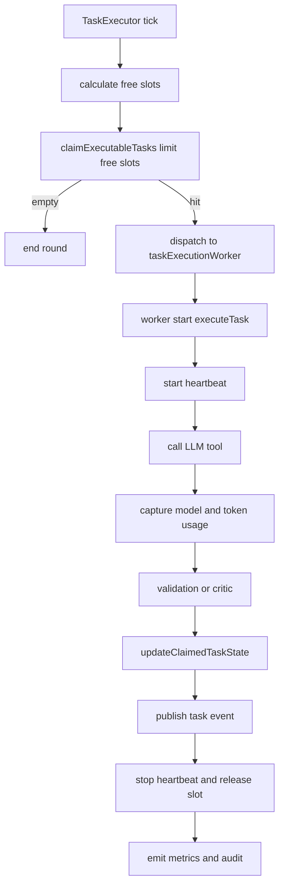
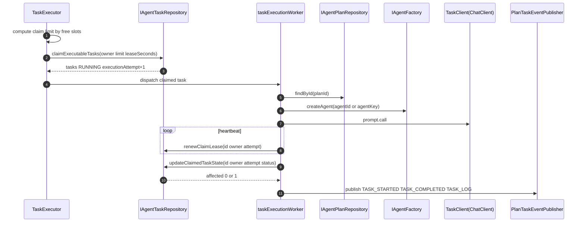

# 功能文档：Task claim 与执行

## 1. 功能目标

- 在多实例下原子 claim 可执行任务。
- 基于 lease 与 heartbeat 保证执行权可回收。
- 基于 `claim_owner + execution_attempt` 防止旧执行者回写污染。

## 2. 业务流程图

## 3. 时序图

## 4. 关键实现定位

- `agent-trigger/src/main/java/com/getoffer/trigger/job/TaskExecutor.java`
- `agent-trigger/src/main/java/com/getoffer/trigger/event/PlanTaskEventPublisher.java`
- `agent-domain/src/main/java/com/getoffer/domain/task/adapter/repository/IAgentTaskRepository.java`
- `agent-infrastructure/src/main/java/com/getoffer/infrastructure/repository/task/AgentTaskRepositoryImpl.java`
- `agent-app/src/main/resources/mybatis/mapper/AgentTaskMapper.xml`
  - `claimExecutableTasks`
  - `renewClaimLease`
  - `updateClaimedTaskState`
  - `countExpiredRunningTasks`

## 5. 原子 claim 与并发语义

- SQL 使用 `WITH picked ... FOR UPDATE SKIP LOCKED` + `UPDATE ... RETURNING`。
- claim 分组：
  - READY-like：`READY + 过期 RUNNING`
  - REFINING：`REFINING`
- 默认策略：READY-like 优先；REFINING 按配额与最小保障领取，避免挤占 READY 或长期饥饿。
- 可 claim 条件：
  - `status in READY REFINING`
  - 或 `status RUNNING and lease_until < now`
- Plan 过滤条件：
  - 仅领取 `agent_plans.status in READY RUNNING` 的任务，避免 PAUSED/CANCELLED 计划任务被空转领取。
- claim 时：
  - `status -> RUNNING`
  - 写入 `claim_owner claim_at lease_until`
  - `execution_attempt = execution_attempt + 1`

## 6. 回写保护

- 续约条件：`id + claim_owner + execution_attempt`
- 终态写回条件：`id + claim_owner + execution_attempt`
- 不满足条件时返回 guard reject，避免旧执行者覆盖新执行者数据。
- 调用超时治理：TaskClient 调用由独立线程池执行，使用 `Future.get(timeout)` 控制单次调用时长。
- 超时时会先写入一条 `task_executions` 记录（`error_type=timeout`），再按策略决定重试或失败。
- 默认策略：超时额外重试 1 次；若连续超时则任务置 `FAILED` 并释放 claim，确保 Plan/Turn 可收敛。
- Plan 黑板（`global_context`）写回策略：
  - 不直接使用执行开始时读取的旧 Plan 对象回写。
  - 每次写回先 `findById(planId)` 获取最新 Plan，再合并本次输出增量。
  - 遇到 Plan 乐观锁冲突执行有限重试（当前最多 3 次），避免高并发下频繁告警。

## 7. 配置项

- `executor.poll-interval-ms`
- `executor.claim.batch-size`
- `executor.claim.max-per-tick`
- `executor.claim.ready-first`
- `executor.claim.refining-max-ratio`
- `executor.claim.refining-min-per-tick`
- `executor.claim.lease-seconds`
- `executor.claim.heartbeat-seconds`
- `executor.execution.timeout-ms`
- `executor.execution.timeout-retry-max`
- `executor.worker.core-size`
- `executor.worker.max-size`
- `executor.worker.queue-capacity`
- `executor.worker.rejection-policy`
- `executor.instance-id`
- `executor.observability.audit-log-enabled`
- `executor.observability.audit-success-log-enabled`

## 8. 指标与审计

核心指标名称：
- `agent.task.claim.poll.total`
- `agent.task.claim.success.total`
- `agent.task.claim.empty.total`
- `agent.task.claim.reclaimed.total`
- `agent.task.claim.ready.count`
- `agent.task.claim.refining.count`
- `agent.task.claim.ready.fallback.count`
- `agent.task.claim.refining.fallback.count`
- `agent.task.dispatch.success.total`
- `agent.task.dispatch.reject.total`
- `agent.task.worker.inflight.current`
- `agent.task.worker.queue.current`
- `agent.task.claim_to_start.latency`
- `agent.task.heartbeat.success.total`
- `agent.task.claimed_update.guard_reject.total`
- `agent.task.execution.total`
- `agent.task.execution.failure.total`
- `agent.task.execution.timeout.total`
- `agent.task.execution.timeout.retry.total`
- `agent.task.execution.timeout.final_fail.total`

执行落库字段（`task_executions`）：
- `attempt_number`
- `execution_time_ms`
- `model_name`
- `token_usage`
- `error_type`
- `error_message`

## 9. 开发要点

- claim 必须受可用执行槽位约束，禁止 claim 超过可派发能力。
- 术语统一：总任务使用 `Plan`；节点执行客户端使用 `TaskClient`；`agent_registry` 记录的是 `AgentProfile`。
- 当执行阶段发现 Plan 不可执行时，必须显式归还 claim：
  - `current_retry > 0` 回滚到 `REFINING`
  - 其余回滚到 `READY`
  - 禁止仅 `return` 留下 RUNNING+lease 等待过期
- 外部副作用调用应尽量幂等，可用 `taskId + executionAttempt` 作为幂等键。
- 执行失败路径要保证有执行记录且任务状态可终结。
- Critic 任务输出属于内部校验信息，不作为最终对用户展示文案来源。

## 10. 测试场景

1. 单实例下 READY 任务正常 claim 并完成。
2. 多实例并发 claim 不重复领取同一条 READY 任务。
3. lease 过期后任务可被重领，旧执行者回写被拒绝。
4. heartbeat 失败时任务最终可被恢复处理。
5. 执行记录中 `model_name/token_usage/error_type` 可正确落库。
