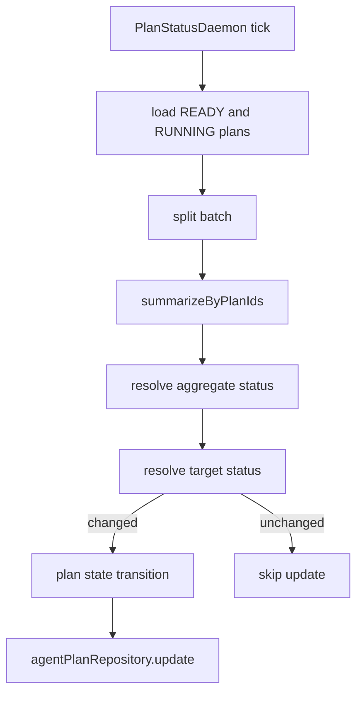
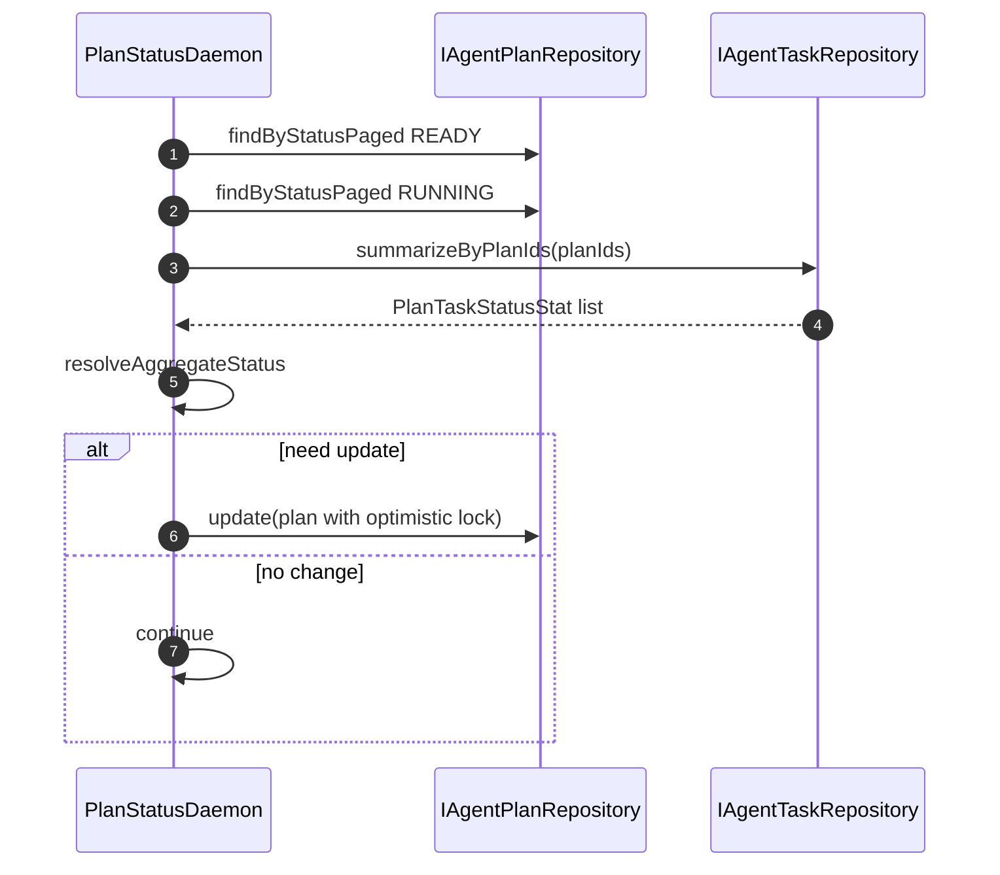

# 功能文档：Plan 状态聚合闭环

## 1. 功能目标

- 由 Task 聚合态自动推进 Plan 状态。
- 建立 `READY -> RUNNING -> COMPLETED or FAILED` 闭环。
- 降低前端轮询与手工更新依赖。

## 2. 聚合与迁移规则

聚合态：
- `NONE`：无任务
- `FAILED`：存在 `FAILED`
- `RUNNING`：存在 `RUNNING VALIDATING REFINING`
- `COMPLETED`：全部是终态 `COMPLETED FAILED SKIPPED` 且无 failed 分支先命中
- `READY`：其余情况

迁移：
- `READY + RUNNING -> RUNNING`
- `READY or RUNNING + COMPLETED -> COMPLETED`
- `READY or RUNNING + FAILED -> FAILED`
- 终态 `COMPLETED FAILED CANCELLED` 不再推进

## 3. 业务流程图

## 4. 时序图

## 5. 关键实现定位

- `agent-trigger/src/main/java/com/getoffer/trigger/job/PlanStatusDaemon.java`
- `agent-domain/src/main/java/com/getoffer/domain/task/model/valobj/PlanTaskStatusStat.java`
- `agent-domain/src/main/java/com/getoffer/domain/planning/model/entity/AgentPlanEntity.java`
- `agent-app/src/main/resources/mybatis/mapper/AgentTaskMapper.xml` 的 `selectPlanStatusStats`
- `agent-infrastructure/src/main/java/com/getoffer/infrastructure/repository/planning/AgentPlanRepositoryImpl.java`

## 6. 配置项

- `plan-status.poll-interval-ms`
- `plan-status.batch-size`
- `plan-status.max-plans-per-round`

## 7. 并发与降噪策略

- 仅状态变化时落库，减少无效写入。
- 乐观锁冲突按 debug 级别记录并跳过，下一轮重算。
- 单个 plan 推进失败不影响同批其它 plan。

## 8. 测试场景

1. 全部任务完成时 Plan 自动转 COMPLETED。
2. 任一任务 FAILED 时 Plan 自动转 FAILED。
3. 有运行中任务时 READY 自动转 RUNNING。
4. 乐观锁冲突时不抛出全局失败，下一轮可恢复。
