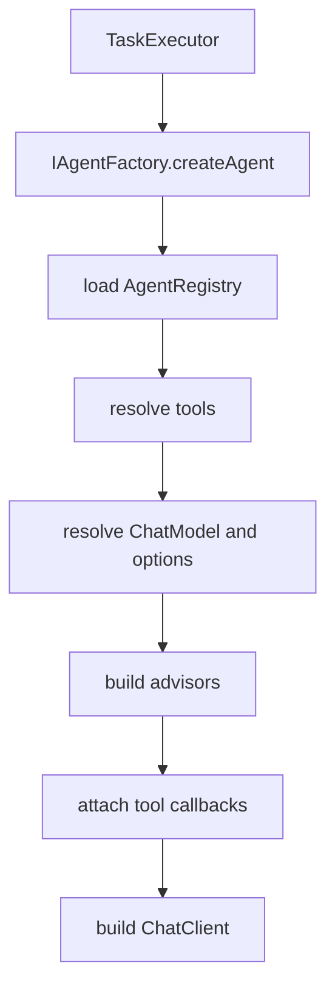
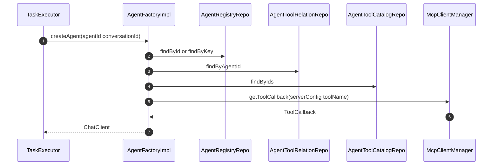

# 功能文档：Agent 工厂与工具链

## 1. 功能目标

- 按 `agentKey` 或 `agentId` 构建可执行 `ChatClient`。
- 解析工具链并注入 Spring AI ToolCalling。
- 按配置组装 Advisor 链，包括 memory rag logger。

## 2. 业务流程图

## 3. 时序图

## 4. 关键实现定位

- `agent-infrastructure/src/main/java/com/getoffer/infrastructure/ai/AgentFactoryImpl.java`
- `agent-infrastructure/src/main/java/com/getoffer/infrastructure/ai/AgentAdvisorFactory.java`
- `agent-infrastructure/src/main/java/com/getoffer/infrastructure/mcp/McpClientManager.java`
- `agent-domain/src/main/java/com/getoffer/domain/agent/adapter/factory/IAgentFactory.java`

## 5. 工具解析策略

- 工具来源：
  - Spring Bean 工具
  - MCP function 工具
- 解析依据：
  - `agent_tools`
  - `agent_tool_catalog`
- 目标产物：
  - `toolNames`
  - `toolCallbacks`
  - `toolContext`
- 配置单一来源：
  - 工具绑定仅通过 `ChatClient.Builder`（`defaultToolNames/defaultToolCallbacks/defaultToolContext`）
  - `OpenAiChatOptions` 仅承载模型参数，不作为工具配置来源
  - `modelOptions` 中出现工具字段会被忽略（可通过兼容开关临时回滚）

## 6. Advisor 组装策略

- ToolCallAdvisor：有工具时默认启用。
- Memory：按 `advisor_config.memory` 选择 Prompt 或 Message 模式。
- RAG：按 `advisor_config.rag` 绑定 `VectorStore` 与 `SearchRequest`。
- Logger：按 `advisor_config.logger` 启用 `SimpleLoggerAdvisor`。

## 7. MCP 适配策略

- 支持传输：
  - `stdio`
  - `sse`
  - `streamable_http`
  - `auto`
- 客户端缓存按 `serverId` 管理。
- 关闭应用时统一执行 `shutdownAll` 释放连接。

## 8. 开发要点

- Agent 配置必须先校验激活状态，再构建 ChatClient。
- 新增工具类型时先扩展 `ToolTypeEnum` 与工具解析分支。
- 新增 Advisor 需明确顺序和开关语义。
- 禁止在 `modelOptions` 中维护工具配置，避免与 Builder 语义冲突。

## 9. 测试场景

1. 按 key 与按 id 创建 Agent 均成功。
2. Agent 未激活时创建失败。
3. MCP 工具配置错误时降级并输出可定位日志。
4. Advisor 配置开关按预期生效。
