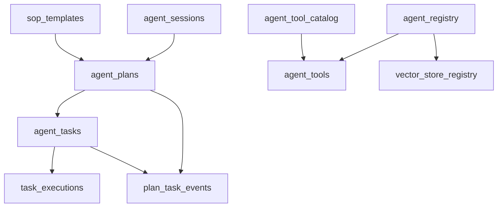
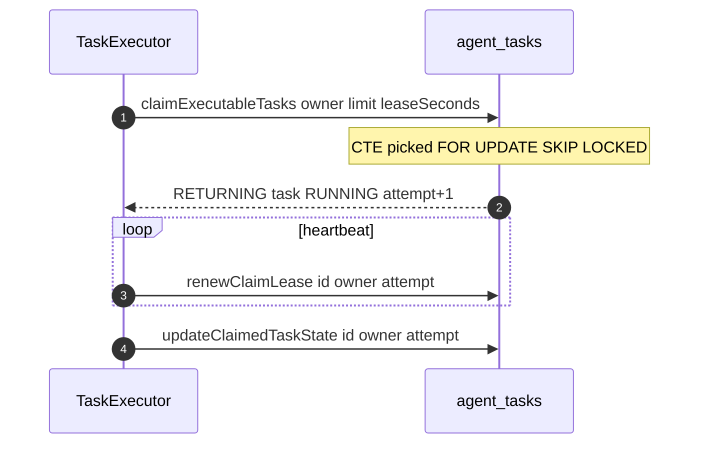

# 功能文档：数据模型与关键 SQL

## 1. 功能目标

- 明确核心表之间的数据关系。
- 标注关键状态字段和并发字段。
- 固化 claim 与聚合统计 SQL 的语义边界。

## 2. 核心数据模型

主要表：
- `agent_sessions`
- `sop_templates`
- `agent_plans`
- `agent_tasks`
- `task_executions`
- `plan_task_events`
- `agent_registry`
- `agent_tool_catalog`
- `agent_tools`
- `vector_store_registry`

## 3. 数据关系图

## 4. claim 关键 SQL 时序

## 5. 并发关键字段

`agent_plans`：
- `status`
- `version`

`agent_tasks`：
- `status`
- `version`
- `claim_owner`
- `claim_at`
- `lease_until`
- `execution_attempt`
- `task_type`（`task_type_enum`）

`task_executions`：
- `attempt_number`
- `execution_time_ms`
- `model_name`
- `token_usage`
- `error_type`

`plan_task_events`：
- `id`（事件游标）
- `plan_id`
- `task_id`
- `event_type`
- `event_data`

## 6. 关键 SQL 入口

- `agent-app/src/main/resources/mybatis/mapper/AgentPlanMapper.xml`
  - `updateWithVersion`
  - `selectByStatusPaged`
- `agent-app/src/main/resources/mybatis/mapper/AgentTaskMapper.xml`
  - `claimExecutableTasks`
  - `renewClaimLease`
  - `updateClaimedTaskState`
  - `selectPlanStatusStats`
- `agent-app/src/main/resources/mybatis/mapper/TaskExecutionMapper.xml`
  - `insert`
  - `getMaxAttemptNumber`
- `agent-app/src/main/resources/mybatis/mapper/PlanTaskEventMapper.xml`
  - `insert`
  - `selectByPlanIdAfterEventId`

## 7. 索引与性能关注点

- claim 扫描索引：`status lease_until plan_id created_at`
- owner 续约索引：`claim_owner lease_until`
- 聚合统计建议按 `plan_id` 优化访问路径
- SSE 事件回放索引：`plan_task_events(plan_id, id)`

## 8. 开发要点

- SQL 方言以 PostgreSQL 为准，避免维护误导性的异构方言脚本。
- 修改字段后同步更新：
  - PO
  - Entity
  - Mapper XML
  - Repository 转换逻辑
- 并发路径改动必须验证 guard 条件仍完整生效。
- PostgreSQL SQL 目录仅维护最终版：`01_init_database.sql`。

## 9. 最终版 SQL

- `docs/dev-ops/postgresql/sql/01_init_database.sql`

## 10. 测试场景

1. 乐观锁更新成功与冲突路径。
2. claim 领取、续约、终态回写全链路。
3. 过期任务重领行为与回写保护。
4. 聚合查询在大批量 `planIds` 下性能与正确性。
5. SSE 断线重连可通过 `lastEventId` 回放事件。
