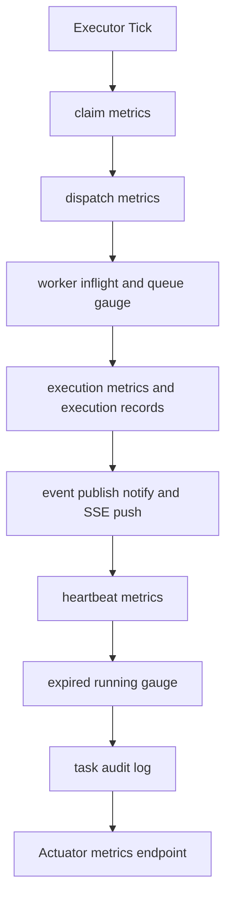
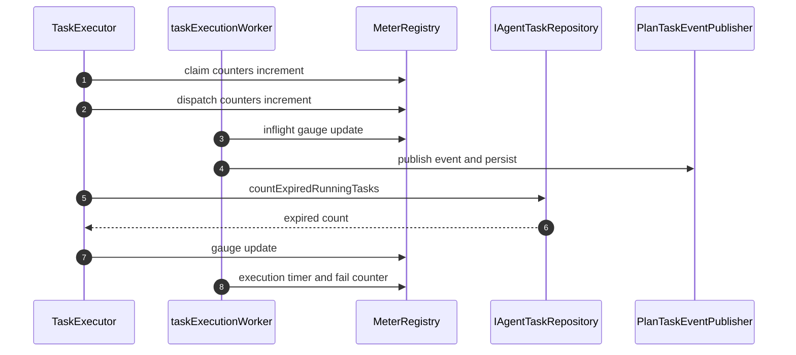

# 功能文档：观测与运维治理

## 1. 功能目标

- 建立执行链路可观测性，支持并发问题快速定位。
- 通过指标和审计日志形成健康闭环。
- 避免守护任务互相阻塞导致系统假死。
- 让 SSE 链路具备“跨实例实时推送 + 断线回放”能力。

## 2. 观测流程图

## 3. 监控时序图

## 4. 关键指标

claim：
- `agent.task.claim.poll.total`
- `agent.task.claim.success.total`
- `agent.task.claim.empty.total`
- `agent.task.claim.reclaimed.total`
- `agent.task.claim.ready.count`
- `agent.task.claim.refining.count`
- `agent.task.claim.ready.fallback.count`
- `agent.task.claim.refining.fallback.count`

dispatch：
- `agent.task.dispatch.success.total`
- `agent.task.dispatch.reject.total`
- `agent.task.worker.inflight.current`
- `agent.task.worker.queue.current`
- `agent.task.claim_to_start.latency`

heartbeat：
- `agent.task.heartbeat.success.total`
- `agent.task.heartbeat.guard_reject.total`
- `agent.task.heartbeat.error.total`

写回：
- `agent.task.claimed_update.success.total`
- `agent.task.claimed_update.guard_reject.total`
- `agent.task.claimed_update.error.total`

执行：
- `agent.task.execution.total`
- `agent.task.execution.duration`
- `agent.task.execution.failure.total`
- `agent.task.execution.timeout.total`
- `agent.task.execution.timeout.retry.total`
- `agent.task.execution.timeout.final_fail.total`

健康：
- `agent.task.expired_running.current`
- `agent.task.expired_running.detected.total`
- `agent.task.expired_running.check_error.total`

SSE：
- 关注连接数、推送失败率、回放批次耗时（建议后续补指标）
- 关注跨实例通知消费延迟与 replay sweep 命中率

多实例 SSE 实时机制：
- 实时层：`PlanTaskEventPublisher` 在事件入库后执行 `pg_notify(channel payload)`，所有实例通过 `LISTEN` 接收信号。
- 分发层：接收通知实例按 `planId/eventId` 回查事件并走本地 SSE 分发。
- 补偿层：`PlanStreamController` 定时执行 replay sweep，按 `lastEventId` 小批量补拉，覆盖通知丢失或连接抖动。

## 5. 审计日志

- 事件由 `emitTaskAudit` 输出，如：
  - `claim_acquired`
  - `claim_reclaimed`
  - `lease_renew_guard_reject`
  - `claimed_update_guard_reject`
- 通过配置控制是否记录成功事件，避免日志刷屏。
- 执行记录结构化字段：
  - `task_executions.model_name`
  - `task_executions.token_usage`
  - `task_executions.error_type`

## 5.1 HTTP 入口链路日志（新增）

- `RequestTraceLoggingFilter` 统一记录 `/api/**` 入口日志，默认排除 `/actuator/**` 与 `/api/plans/*/stream`。
- 每个请求都注入并回传 `X-Trace-Id` / `X-Request-Id`，同时写入 MDC：`traceId`、`requestId`。
- 入口日志事件：
  - `HTTP_IN`：请求进入（method/path/query/clientIp/userAgent）
  - `HTTP_OUT`：请求结束（status/responseCode/costMs/outcome）
  - `HTTP_ERROR`：统一异常出口日志（errorType/errorCode/errorMessage）
- 关键业务审计事件：
  - `CHAT_ACCEPTED`（会话受理并创建 plan）
  - `ROUTING_DECIDED`（路由决策已落库）
  - `TURN_FINALIZED`（回合终态已落库）

配置项（`application*.yml`）：
- `observability.http-log.enabled`
- `observability.http-log.include-path-patterns`
- `observability.http-log.exclude-path-patterns`
- `observability.http-log.sample-rate`
- `observability.http-log.slow-request-threshold-ms`
- `observability.http-log.log-request-body`
- `observability.http-log.request-body-whitelist`
- `observability.http-log.mask-fields`
- `observability.http-log.max-body-length`

## 5.2 关键告警语义（当前版本）

- `Root candidate planning failed ... attempt=x/3`：
  - 含义：Root 候选草案调用失败，正在重试。
  - 处置：重点排查模型网关配置（`api-key/base-url/completions-path/model`）与 `root` profile 状态。
- `Root candidate planning exhausted retries. fallback to single-node candidate`：
  - 含义：Root 连续失败后已降级为单节点候选 Workflow Draft，系统可继续执行。
  - 处置：非阻断告警；优先修复 Root 可用性，避免长期退化为单节点。
- `Failed to update plan context after retries ... Optimistic lock failed`：
  - 含义：Task 执行时黑板写回在并发竞争下重试仍失败。
  - 处置：通常不影响任务终态，但会导致部分上下文字段丢失；应排查高并发热点计划与写回键冲突。
- `Task execution timed out ... exhausted retries`：
  - 含义：TaskClient 调用超时，且已达到额外重试上限（默认重试 1 次）。
  - 处置：检查模型网关可用性、`executor.execution.timeout-ms` 阈值是否合理、下游网络稳定性。
- 用户回复出现 `{"pass":...,"feedback":...}`：
  - 含义：Critic 输出被错误透传，属于回归缺陷。
  - 处置：校验 `TurnResultService` 是否仅汇总 `WORKER` 输出。

## 6. 调度线程治理

- 当前使用隔离调度器：
  - `taskExecutorScheduler`
  - `daemonScheduler`
- 配置位于 `scheduling.task-executor.*` 与 `scheduling.daemon.*`。
- 目标是避免 `TaskExecutor` 长调用阻塞状态推进守护任务。

## 6.1 SSE 配置要点

- `sse.heartbeat-interval-ms`：心跳间隔。
- `sse.replay-interval-ms`：连接存活期补偿回放间隔。
- `event.notify.channel`：PostgreSQL 通知通道名，多实例必须一致。
- `event.publisher.instance-id`：实例标识，建议由部署层注入，便于排障与去重。

## 7. 运维排障建议

1. 看 claim 成功率与空批率判断是否拥塞或空转。
2. 看 `expired_running.current` 判断 lease 风险。
3. 看 guard reject 指标判断是否存在旧执行者回写。
4. 看 dispatch reject 与 worker queue 判断是否需要降载或扩容。
5. 看 `agent.task.execution.timeout.*` 指标，区分“偶发超时重试成功”与“最终超时失败”。
6. 看 SSE 推送失败日志与回放游标是否连续。
7. 多实例环境确认 `event.notify.channel` 一致，且 `PUBLISHER_INSTANCE_ID` 可区分实例。
8. 前端反馈异常时先收集 `X-Trace-Id`，再检索 `HTTP_IN/HTTP_OUT/HTTP_ERROR` 三类日志。
9. 未命中 Workflow Definition 频繁降级时，检查：
   - `planner.root.agent-key` 是否存在且激活
   - `planner.root.fallback.agent-key` 是否指向可用 profile（建议 `assistant`）
   - `docs/dev-ops/postgresql/sql/01_init_database.sql` 是否已执行并包含基线 `assistant/root`

## 8. 测试场景

1. 压测下指标持续可见且无明显缺失。
2. 模拟 DB 抖动时审计日志与错误指标可定位问题。
3. 调整调度线程池后，守护任务周期仍稳定。
4. Root 调用失败时，日志应呈现 `attempt=1/3 -> 3/3 -> fallback` 的完整链路。
5. 含 Critic 节点的计划完成后，最终 Assistant 消息不应包含 Critic JSON。
6. 模拟 TaskClient 超时：首次超时重试一次可成功；连续超时应推动 task/plan/turn 进入 FAILED 终态。
7. 前端任意失败请求都可通过 `X-Trace-Id` 串联到统一入口日志与异常日志。
