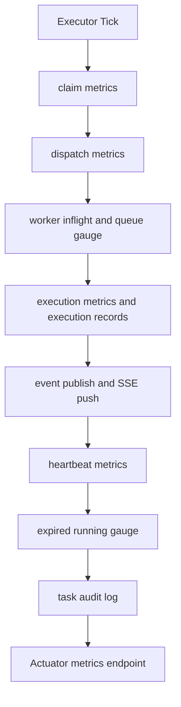
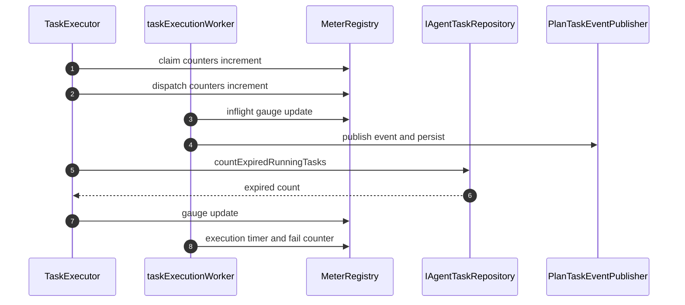

# 功能文档：观测与运维治理

## 1. 功能目标

- 建立执行链路可观测性，支持并发问题快速定位。
- 通过指标和审计日志形成健康闭环。
- 避免守护任务互相阻塞导致系统假死。
- 让 SSE 链路具备“实时推送 + 断线回放”能力。

## 2. 观测流程图

## 3. 监控时序图

## 4. 关键指标

claim：
- `agent.task.claim.poll.total`
- `agent.task.claim.success.total`
- `agent.task.claim.empty.total`
- `agent.task.claim.reclaimed.total`
- `agent.task.claim.ready.count`
- `agent.task.claim.refining.count`
- `agent.task.claim.ready.fallback.count`
- `agent.task.claim.refining.fallback.count`

dispatch：
- `agent.task.dispatch.success.total`
- `agent.task.dispatch.reject.total`
- `agent.task.worker.inflight.current`
- `agent.task.worker.queue.current`
- `agent.task.claim_to_start.latency`

heartbeat：
- `agent.task.heartbeat.success.total`
- `agent.task.heartbeat.guard_reject.total`
- `agent.task.heartbeat.error.total`

写回：
- `agent.task.claimed_update.success.total`
- `agent.task.claimed_update.guard_reject.total`
- `agent.task.claimed_update.error.total`

执行：
- `agent.task.execution.total`
- `agent.task.execution.duration`
- `agent.task.execution.failure.total`

健康：
- `agent.task.expired_running.current`
- `agent.task.expired_running.detected.total`
- `agent.task.expired_running.check_error.total`

SSE：
- 关注连接数、推送失败率、回放批次耗时（建议后续补指标）

## 5. 审计日志

- 事件由 `emitTaskAudit` 输出，如：
  - `claim_acquired`
  - `claim_reclaimed`
  - `lease_renew_guard_reject`
  - `claimed_update_guard_reject`
- 通过配置控制是否记录成功事件，避免日志刷屏。
- 执行记录结构化字段：
  - `task_executions.model_name`
  - `task_executions.token_usage`
  - `task_executions.error_type`

## 6. 调度线程治理

- 当前使用隔离调度器：
  - `taskExecutorScheduler`
  - `daemonScheduler`
- 配置位于 `scheduling.task-executor.*` 与 `scheduling.daemon.*`。
- 目标是避免 `TaskExecutor` 长调用阻塞状态推进守护任务。

## 7. 运维排障建议

1. 看 claim 成功率与空批率判断是否拥塞或空转。
2. 看 `expired_running.current` 判断 lease 风险。
3. 看 guard reject 指标判断是否存在旧执行者回写。
4. 看 dispatch reject 与 worker queue 判断是否需要降载或扩容。
5. 看 SSE 推送失败日志与回放游标是否连续。

## 8. 测试场景

1. 压测下指标持续可见且无明显缺失。
2. 模拟 DB 抖动时审计日志与错误指标可定位问题。
3. 调整调度线程池后，守护任务周期仍稳定。
