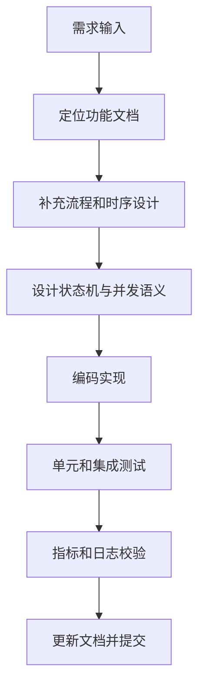
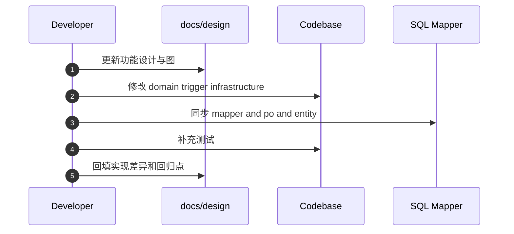

# 功能文档：开发指南与回归清单

## 1. 目标

- 提供统一开发路径，减少临时修补。
- 将功能变更和并发一致性检查前置。
- 形成可执行的提测与上线前核对清单。

## 2. 开发流程图

## 3. 开发时序图

## 4. 新增功能标准步骤

1. 先确定落在哪个功能文档，补齐目标与边界。
2. 明确状态迁移和失败语义，再开始编码。
3. 并发路径必须定义 guard 条件和冲突处理。
4. 同步更新：
   - Controller or Daemon
   - Domain Entity
   - Repository and Mapper
   - 文档中的流程图和时序图
5. 涉及事件流时，同步验证“发布、持久化、订阅、回放”四条链路。

## 5. 代码变更清单

- 是否新增或修改了状态机迁移规则。
- 是否影响 claim 或 lease 或 executionAttempt。
- 是否影响 `version` 乐观锁路径。
- Task 类型是否统一使用 `TaskTypeEnum`（禁止字符串常量漂移）。
- 是否新增配置项并提供默认值。
- 是否新增指标和日志用于排障。
- Agent 工具配置是否只在 `ChatClient.Builder` 单点写入（避免 Options/Builder 双写）。
- SSE 变更是否遵循事件驱动，不引入每连接轮询线程。
- 页面只读能力是否保持契约完整（`session/plans/tasks/executions/overview`）。
- Root/Assistant 语义是否清晰：
  - Root 用于未命中 Workflow Definition 的候选草案规划
  - Assistant 用于候选节点缺省执行兜底（`planner.root.fallback.agent-key`）
- 最终用户回复是否只汇总 `WORKER` 输出，避免 `CRITIC` 校验 JSON 外泄。
- Task 黑板写回是否采用“读取最新 Plan + 乐观锁重试”策略，而非旧对象直接覆盖。

## 6. SQL 变更清单

- 表结构字段是否与 PO Entity Mapper 三方同步。
- 索引是否覆盖关键查询条件和排序字段。
- 是否存在跨数据库方言冲突风险。
- 是否已同步更新最终版 SQL：`docs/dev-ops/postgresql/sql/01_init_database.sql`。

## 7. 回归测试清单

功能：
- 会话创建
- 聊天触发规划
- 查询会话详情与计划列表
- `overview` 首屏聚合返回完整（会话/计划/最新计划统计/任务明细）
- 任务执行历史查询（attempt 顺序、model/token/error 字段）
- 任务依赖推进
- 任务执行完成
- Plan 自动闭环
- 未命中 Workflow Definition 时 Root 草案重试 3 次后降级单节点候选 Workflow Draft
- 候选节点缺省 `agentId/agentKey` 时自动注入 fallback `assistant`
- 含 Critic 节点计划完成后，最终回复不包含 `{"pass":...}` JSON

并发：
- 多实例并发 claim
- lease 过期重领
- 旧执行者回写拒绝
- 乐观锁冲突恢复
- SSE 重连后基于 `lastEventId` 的回放正确性
- Plan 黑板并发写回冲突下的有限重试与最终一致性

观测：
- 指标可见
- 审计日志可定位
- 异常路径有明确错误分类
- 执行记录 `model_name/token_usage/error_type` 落库完整
- SSE 与查询 API 协同验证：断开 SSE 后仅靠查询 API 可恢复页面状态基线

## 8. 提交与评审建议

- 提交信息直接体现功能域，例如 `feature: claim guard hardening`。
- PR 描述必须包含：
  - 功能目标
  - 状态迁移变化
  - 并发一致性策略
  - 回归测试结果
  - 迁移脚本执行说明

## 9. 验证命令基线

- 联编校验：`mvn -pl agent-app -am -DskipTests test-compile`
- 指定回归：`mvn -pl agent-app -am -DskipTests=false -Dtest=PlanStatusDaemonTest -Dsurefire.failIfNoSpecifiedTests=false test`
- Root 草案与兜底：`mvn -pl agent-app -am -DskipTests=false -Dtest=PlannerServiceRootDraftTest -Dsurefire.failIfNoSpecifiedTests=false test`
- 执行边界：`mvn -pl agent-app -am -DskipTests=false -Dtest=TaskExecutorPlanBoundaryTest -Dsurefire.failIfNoSpecifiedTests=false test`
- 回合汇总：`mvn -pl agent-app -am -DskipTests=false -Dtest=TurnResultServiceTest -Dsurefire.failIfNoSpecifiedTests=false test`
- PostgreSQL 并发语义集成测试（需 Docker）：
  `mvn -pl agent-app -am -DskipTests=false -Dit.docker.enabled=true -Dtest=TaskClaimRepositoryIntegrationTest -Dsurefire.failIfNoSpecifiedTests=false test`
- Chat -> Plan -> SSE 闭环集成测试（需 Docker）：
  `mvn -pl agent-app -am -DskipTests=false -Dit.docker.enabled=true -Dtest=SessionChatPlanSseIntegrationTest -Dsurefire.failIfNoSpecifiedTests=false test`
