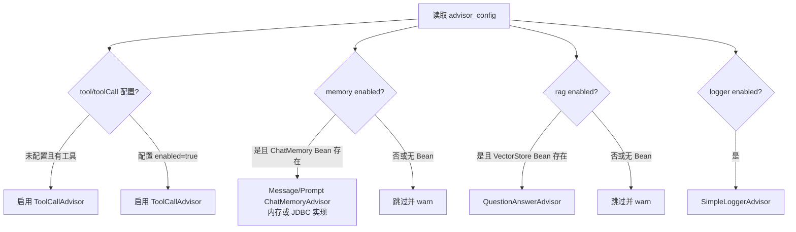
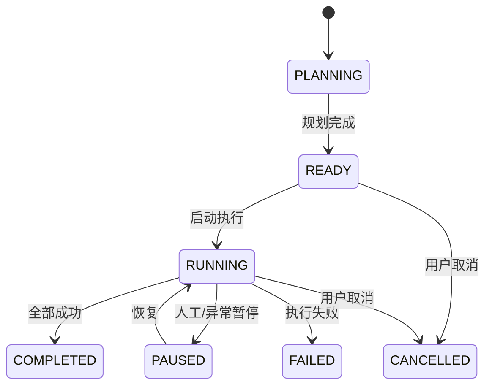
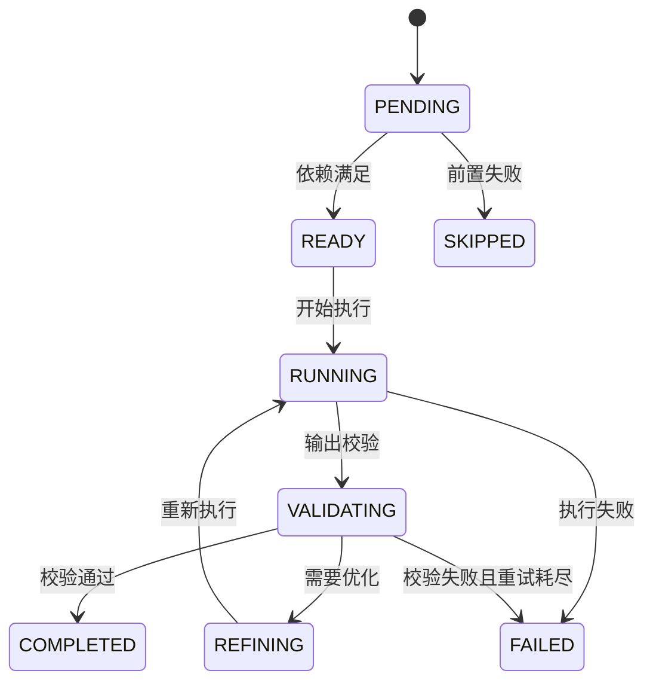

# 软件设计说明书

> 版本说明：设计与实现基于 Spring AI 1.1.2 API。

## 概要设计 (HLD)

### 1. 系统架构
- **形态**：单体应用（Spring Boot）+ DDD 分层的多模块 Maven 工程。
- **分层**：
  - `agent-app`：应用启动与全局配置装配。
  - `agent-trigger`：入口适配层（http/job/listener）。
  - `agent-domain`：领域模型与端口接口。
  - `agent-infrastructure`：仓储与第三方适配实现。
  - `agent-api` / `agent-types`：对外 DTO 与通用类型。

### 2. 技术栈与选型原因
- **Java 17 + Spring Boot 3.x**：现代 LTS 版本，生态成熟，便于快速装配与运维。
- **MyBatis**：SQL 可控性强，适合复杂报表/JSONB 字段读写。
- **PostgreSQL**：支持 JSONB，便于存储 `model_options` / `advisor_config` 等配置；可扩展向量能力（如 pgvector）。
- **Spring AI 1.1.2**：统一 ChatClient/Advisor/ToolCalling 规范，降低模型厂商差异。
- **Guava Cache**：轻量本地缓存，覆盖简单热数据场景。
- **Jackson**：统一 JSON 序列化/反序列化，避免多库混用带来的兼容差异。

### 3. 第三方服务集成
- **LLM 模型提供方**：通过 `spring.ai.openai.*` 接入 OpenAI（或兼容 OpenAI 协议的服务）。
- **向量存储**：设计上支持 VectorStore（如 pgvector / milvus / chroma），以 Bean 方式装配；当前仓储已具备注册信息模型。
- **MCP 工具服务**：支持通过 MCP Server 以进程方式提供工具能力（按工具配置启动/保持连接）。
- **观测**：若存在 `ObservationRegistry`，ToolCalling 自动接入链路观测。
- **消息队列/分布式缓存**：当前未引入；如后续需要可在 infrastructure 扩展。

## 详细设计 (LLD)

### 1. 核心业务逻辑流程图

#### 1.1 Agent 工厂构建流程
```mermaid
flowchart TD
    A[输入 agentKey / agentId] --> B[读取 AgentRegistry]
    B --> C{Agent 是否存在且激活?}
    C -- 否 --> X[抛出异常]
    C -- 是 --> D[解析工具关系 agent_tools]
    D --> E[过滤禁用/未激活工具]
    E --> F[解析工具类型: SPRING_BEAN/MCP_FUNCTION]
    F --> G[生成 toolNames / toolCallbacks / toolContext]
    G --> H[解析 ChatModel (provider bean 或默认)]
    H --> I[构建 ChatOptions]
    I --> J[AdvisorFactory 解析 advisor_config]
    J --> K[ChatClient.builder(chatModel) 组装]
    K --> L[build ChatClient]
```

#### 1.2 Advisor 选择流程


### 2. 关键算法说明

**2.1 工具解析算法**
- 输入：`agent_tools` 关联集合。
- 逻辑：
  - 按 `priority` 升序排序，过滤 `is_enabled=false` 与工具未激活的记录。
  - `SPRING_BEAN`：优先读取 `tool_config.beanName`，否则使用 `tool_name` 作为工具名。
  - `MCP_FUNCTION`：根据 `tool_config.mcpServerConfig`（或 `tool_config` 直配）构建 `ToolCallback`。
- 输出：`toolNames` 去重集合 + `toolCallbacks` 列表。

**2.2 Advisor 解析算法**
- 输入：`advisor_config`（JSON → `AgentAdvisorConfig` POJO）。
- 逻辑：
  - 使用 Jackson 将 JSON 配置映射为强类型配置（支持 `toolCall`/`simpleLogger` 等别名字段）。
  - 优先读取 `tool` 配置；若未配置且存在工具，默认启用。
  - `memory`/`rag`/`logger` 开关为 false 时跳过；缺少 Bean 时降级。
  - `memory` 支持通过 `beanName` 指定 ChatMemory（内存/JDBC 等）。
  - 支持 `order` 控制 Advisor 顺序。
- 输出：`List<Advisor>`。

**2.3 ChatModel 解析算法**
- 优先使用 `model_provider` 对应的 `ChatModel` Bean（同名 Bean）。
- 若未匹配到，则使用默认 `ChatModel` Bean。

**2.4 ChatOptions 构建算法**
- `model_provider=openai` 时优先 `OpenAiChatOptions`，否则回退 `ChatOptions`。
- 从 `model_options` 映射 `temperature/topP/topK/maxTokens/stop*` 等字段。
- 将 `toolNames` 与 `toolContext` 注入 options（`toolCallbacks` 由 ChatClient 直接装配）。

**2.5 MCP 客户端管理**
- 通过 `McpClientManager` 管理 MCP Server 生命周期，支持多传输方式：stdio / SSE / Streamable HTTP。
- stdio：基于 `command/args/env/workDir` 启动进程，stdout 仅输出协议消息、stderr 独立消费日志。
- stdio 协议采用 JSON-RPC 2.0 帧格式（`Content-Length: N\\r\\n\\r\\n` + body）。
- Streamable HTTP：对配置的 `url/endpoint` 进行 POST，`Accept` 同时支持 `application/json` 与 `text/event-stream`，并解析响应结果。
- SSE（旧协议兼容）：先建立 SSE 连接获取 `endpoint` 事件，再通过该 URL POST JSON-RPC 请求，响应通过 SSE `message` 返回。
- 工具调用通过 `McpToolCallback` 转发，输入参数自动尝试解析为 JSON 对象并作为 `arguments` 传递。
- 支持 `readTimeoutMs/timeoutMs` 读取超时配置，超时后返回错误；HTTP 连接支持 `connectTimeoutMs`。

### 3. 复杂状态机模型

#### 3.1 计划状态机（PlanStatusEnum）


#### 3.2 任务状态机（TaskStatusEnum）

