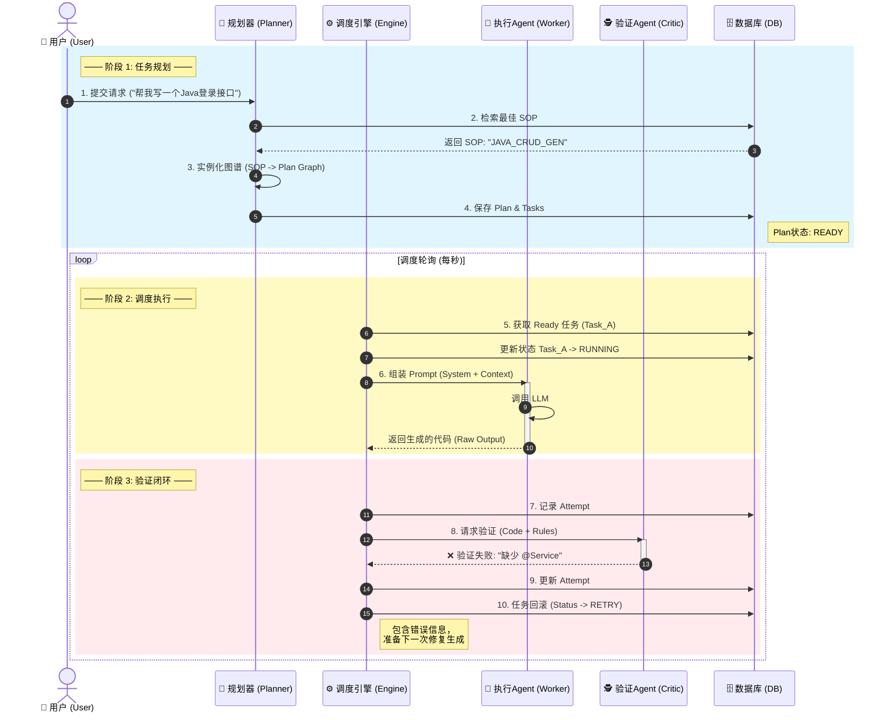

```mermaid
sequenceDiagram
    autonumber

    actor User as 👤 用户 (User)
    participant Planner as 🧠 规划器 (Planner)
    participant Scheduler as ⚙️ 调度引擎 (Engine)
    participant Worker as 🤖 执行Agent (Worker)
    participant Critic as 🕵️ 验证Agent (Critic)
    participant DB as 🗄️ 数据库 (DB)

%% ==========================================
%% 阶段 1: 任务规划
%% ==========================================
    rect rgb(225, 245, 254)
        Note right of User: ─── 阶段 1: 任务规划 ───
        User->>Planner: 1. 提交请求 ("帮我写一个Java登录接口")
        Planner->>DB: 2. 检索最佳 SOP
        DB-->>Planner: 返回 SOP: "JAVA_CRUD_GEN"
        Planner->>Planner: 3. 实例化图谱 (SOP -> Plan Graph)
        Planner->>DB: 4. 保存 Plan & Tasks
        Note right of DB: Plan状态: READY
    end

%% ==========================================
%% 阶段 2 & 3: 调度与验证循环
%% ==========================================
    loop 调度轮询 (每秒)
    %% --- 阶段 2: 执行 ---
        rect rgb(255, 249, 196)
            Note right of User: ─── 阶段 2: 调度执行 ───
            Scheduler->>DB: 5. 获取 Ready 任务 (Task_A)

            Scheduler->>DB: 更新状态 Task_A -> RUNNING

        %% 组装 Prompt
            Scheduler->>Worker: 6. 组装 Prompt (System + Context)
            activate Worker
            Worker->>Worker: 调用 LLM
            Worker-->>Scheduler: 返回生成的代码 (Raw Output)
            deactivate Worker
        end

    %% --- 阶段 3: 验证 ---
        rect rgb(255, 235, 238)
            Note right of User: ─── 阶段 3: 验证闭环 ───

            Scheduler->>DB: 7. 记录 Attempt #1 (Executions表)

            Scheduler->>Critic: 8. 请求验证 (Code + Rules)
            activate Critic
            Critic-->>Scheduler: ❌ 验证失败: "缺少 @Service"
            deactivate Critic

            Scheduler->>DB: 9. 更新 Attempt #1 (is_valid=False)
            Scheduler->>DB: 10. 任务回滚 (Status -> RETRY)
            Note right of Scheduler: 包含错误信息，<br/>准备下一次修复生成
        end
    end
```